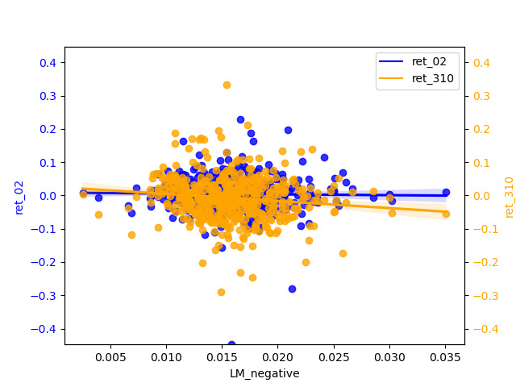
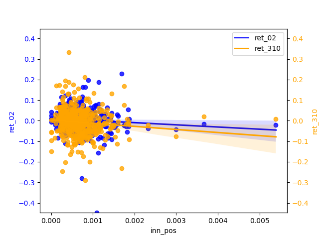

# Report of the HTML analysis project

## Summary section

The main purpose of the whole project is to calculate two new return values( based on s&p 500 and year of 2 ), one within three days of the filing date release and one within eight days after three days of the release date. Based on these two sets of return values evaluate the relationship between sentiment and return. In my analysis: Positive sentiment is more significant in text analysis.

## Data section

### 1.1 about samples

Based on the s&p 500 in Wikipedia as the base of the whole dataframe, the accession_id of each company is then extracted to facilitate access to information on the filing_date of each company. 

The second main step is to do the sentiment analysis, clean up the initial html file, and get the score against the dictionary. Also build 3 pairs of variables to test the score.

### 1.2 about return variables

*mention:* Prepare before calculating return by converting the date column from a string format to a datetime format. And then I merged the two dataframe(return and filing_datedf) based on 'Symbol'. In the following steps I am focus on calculating two returns.

A new column 'Count' is introduced to assign a unique counter value to each row of a time series data, for use in subsequent time series analysis and visualization. **Specifically**, if each date and Filing Date are equal, then the row corresponds to a filing date, and Count is set to 0, and the counter cc_value is reset to 1. If date is greater than Filing Date, then the row corresponds to a date after the filing date, and Count is set to the current value of the counter cc_value, and cc_value is incremented by 1. If date is less than Filing Date, then the row corresponds to a date before the filing date, and Count is set to -2, and cc_value is reset to 1.

*sample code:*
```
merged_df['Count'] = -1
cc_value=1
for index,row in merged_df.iterrows():
    if row['date']==row['Filing Date']:
        merged_df.loc[index,'Count']=0
        cc_value=1
    elif row['date']>row['Filing Date']:
        merged_df.loc[index,'Count']=cc_value
        cc_value += 1
    else:
        merged_df.loc[index,'Count']=-2
        cc_value=1
```

**ret_02:** and **ret_310:**

The first return satisfies the filing_date as the start date and lasts until the third day of a time span. The second return satisfies the next 8 days of a time span.

The method```(merged_df['Count'] >= 0)&(merged_df['Count'] <= 2)``` and ```(merged_df['Count'] >= 3)&(merged_df['Count'] <= 10)``` can be used to filter the returns within the dates we need, and then apply the formula ```(lambda x: np.prod(1 + x) - 1)```to calculate the returns for 3 days and 8 days respectively, resulting in 2 new columns of data that we need.

### 1.3 about sentiment variables

**1.3.1 Preprocessing of the sentiment dictionary**

First of all, I Take out the score greater than 0 as the positive or negative word to judge the sentiment, take the positive one for instance: ```sum([word.lower() in positive_words for word in text_words])``` (note that because the cleaned text to all lowercase, so the contents of the dictionary should also be all converted to lowercase.) And then calculate the score by formula such as: 
```text_words = text.lower().split()``` 
```positive_word_count / len(text_words)``` 


**1.3.2 Set new sentiment variables:**

The general direction of my filtering variables is the social and governance part of ESG, and then focus on the innovation point of the company, the integrity and the teamwork ability.

**Integrity:** The integrity of the information presented in the 10-K is crucial, it can be reflected in employee welfare, transparency, honesty, gender and age balance, fair management, etc. Any misrepresentation or omission can have serious legal and financial consequences. It is an important indicator of the company's development.

**Aspects of integrity:**

1. Review the company's financial statements and evaluate whether they are consistent with industry norms and regulatory requirements.

1. Review the company's disclosures related to internal controls and risk management as well as disclosures related to any material weaknesses or deficiency.

1. Review the transparency and completeness of company and evaluate whether the company has provided sufficient information to allow investors to make informed decisions about the company's financial condition and prospects.


**Innovation:** Innovation is a key driver of growth and competitiveness in many industries. Companies that are able to innovate successfully are often able to create new markets and disrupt existing ones. The 10-K may contain information about a company's research and development efforts, new products or services, and partnerships or collaborations that could be indicative of its innovation capabilities. 

**Aspects of innovation:**

1. Patents and Intellectual Property: If the innovation is related to a new product or technology. This can give us an idea of the strength of the company's intellectual property position, and whether they are likely to face competition in the market.

1. Research and Development: Companies often disclose their research and development (R&D) activities in their 10-K filings. About hired technical staff, cooperation projects with universities or research institutes, etc.

1. Competition and Market Size: The size of the company can also reflect the creativity to a certain extent, and can also linked to the same level of competitors, and any market trends or disruptions that could affect the company's ability to succeed. 

**Collaboration:** Collaboration is becoming increasingly important in today's business environment, as companies seek to leverage the expertise and resources of partners and stakeholders to achieve common goals. The ability to collaborate maximizes productivity and positive cooperation feeds back into a harmonious and positive internal and external company environment. The 10-K may contain information about a company's partnerships, joint ventures, or other collaborative efforts that could be indicative of its ability to work effectively with others. 

**Aspects of collaboration:**

1. Teamwork and innovation have a mutually reinforcing correlation that reflects the soundness of a company's organizational structure at the management level, as well as its corporate culture.

*sample of calculate the sentiment scores:*
```
def calculate_sentiment(text, negative_words):
    text_words = text.lower().split()
    negative_word_count = sum([word.lower() in negative_words for word in text_words])
    return negative_word_count / len(text_words)

LM_negative_set = set(list(map(lambda x: x.lower(), LM_negative)))
df2['LM_negative'] = df2['cleaned_text'].apply(lambda x: calculate_sentiment(x, LM_negative_set))
```


### 1.4 summary stats of the final analysis

In the final dataframe, I merged the accession_Num and found the Filing Date of each company and then get each returns. Also, it combines with the 10 analytical sentiment variables. 

Since the variables I chose are more targeted, adhering to the principle of not picking too many or too few words my various positives and negatives are mainly around **50** words. Contrasting with the given dictionary, I noticed that the scores I got from innovation, integrity and collaboration are much lower. The reason might be that I need to drag more related positive and negative words.  

### 1.5 smell tests

There are no overly fishy cases, because I don't use packages from unknown sources.


### 1.6 preferred attitude

About the selection of my variable all are measurable and the regression model of this correlation is relative, and for the five variables I have chosen, it seems that the concentration of three variables is relatively higher for the POSITIVE than for the two NEGATIVE. However, when we lengthen the period of return, we can find that the regression equation of negative is more q-skewed than that of positive in most cases, indicating that the q-sentiment of negative will ripple to a greater extent or fluctuation to return.

*Please see below for the detailed regression chart*

### 1.7 caveats about the sample and data

Note that some companies do not have 10-k files when doing data mining, and there are also cases where the filing_date of some companies may happen to overlap with a holiday, so the return value of some companies will be missing. 

Also, pay attention to the discontinuity of the time series when calculating the return, and avoid holidays when making up some code.

## Results

## 2.1 graphs


```python
from IPython.display import Image, display
import os

# all files
for filename in os.listdir("regression_graph"):
    # end with .png
    if filename.endswith(".png"):
        # display 
        display(Image(filename=os.path.join("regression_graph", filename)))
```


    

    


    

    


    

    


    

    


    

    


    

    


    

    


    

    


    

    


    

    


## 2.2 analysis

### 2.2.1 Compare / contrast the relationship between the ret_02 variable and the two “LM Sentiment” variables and two “ML Sentiment”

- LM Sentiment and ret_02:

The slope of negative is almost zero, but it is more concentrated than positive. positive has a relatively significant slope of regression and has some negative correlation. The narrow magnitude of the regression line may also indicate that the estimates of the regression line are not accurate enough and therefore insensitive to changes in the independent variables.

- ML Sentiment and ret_02:

The correlation between ret_02 and the positive and negative of ML is basically zero. If we must compare a conclusion, the slope of the regression line of the negative is slightly larger than that of the positive, so the significance of the negative is stronger.

### 2.2.2 Contrast ML analysis table
From table3 of ML_JFE.pdf, we can see the t-test value is very low. when the value is high indicates a strong correlation, then his analysis of the results of this writing data means that the correlation of return is still very low, but the correlation after the increase in the number of days is greater than the more short-term, so the results of his picture analysis and my conclusions are basically the same.

### 2.2.3 the analysis of sentiment I selected

In my graphs, most of the scatter points are clustered around zero, it usually indicates a strong linear relationship between the X and Y variables, but their relationship is not simply positive or negative. This situation is often referred to as "centered skewness" or "homoscedasticity".

Centered skewness usually refers to data that shows a symmetric distribution but has a large skewness in one direction. In this case, data points will cluster around the central position. This typically means that there is a relationship between X and Y, but a more complex model is needed to explain their relationship, such as polynomial regression or nonlinear regression.

Homoscedasticity usually refers to a linear relationship between X and Y, but this relationship has different variances in different parts of the data. Therefore, most scatter points are clustered around zero, and extreme values are relatively few. In this case, using a normal linear regression model may not fully capture this heteroscedasticity, and weighted least squares or other methods may be needed to handle it.

The magnitude widens in the tail and the uncertainty in the predicted values increases, so that for relatively high values of return predictions may produce greater prediction errors. And there is a certain correlation between X and Y, but this relationship is more complex and requires further exploration and modeling to explain.

*(The economic aspects of my choice of these variables as sentiment have been described above)*


### 2.2.4 ML analysis

From the perspective of 'ret_02', the positive scores are biased to be concentrated around 0.025 and the negatives are biased to be around 0.015. The regression line is almost smooth ,therefore, of little significant reference. 'ret_310' has a more pronounced slope b of the h regression line than 'ret_02' and shows a weak negative correlation for the positive and a relatively more pronounced negative correlation for the negative. And the diffusion of magnitudes in the tail is not severe, indicating that the longer the period, the negative can be used as a predictor of return.


```python

```
