```python
import pandas as pd
import numpy as np
import matplotlib.pyplot as plt
import seaborn as sns
from scipy import stats
from scipy.stats import norm
from sklearn.preprocessing import StandardScaler
import warnings
warnings.filterwarnings('ignore')
%matplotlib inline
```


```python
train = pd.read_csv("training.csv")
test = pd.read_csv("testing.csv")
```

### EDA Analysis


```python
train.info()
```

    <class 'pandas.core.frame.DataFrame'>
    RangeIndex: 1385 entries, 0 to 1384
    Data columns (total 71 columns):
     #   Column         Non-Null Count  Dtype  
    ---  ------         --------------  -----  
     0   Heating        1385 non-null   object 
     1   HeatingQC      1385 non-null   object 
     2   CentralAir     1385 non-null   object 
     3   Electrical     1384 non-null   object 
     4   1stFlrSF       1385 non-null   int64  
     5   2ndFlrSF       1385 non-null   int64  
     6   GrLivArea      1385 non-null   int64  
     7   BsmtFullBath   1385 non-null   int64  
     8   BsmtHalfBath   1385 non-null   int64  
     9   FullBath       1385 non-null   int64  
     10  HalfBath       1385 non-null   int64  
     11  BedroomAbvGr   1385 non-null   int64  
     12  KitchenAbvGr   1385 non-null   int64  
     13  KitchenQual    1385 non-null   object 
     14  TotRmsAbvGrd   1385 non-null   int64  
     15  Functional     1385 non-null   object 
     16  Fireplaces     1385 non-null   int64  
     17  FireplaceQu    731 non-null    object 
     18  GarageType     1306 non-null   object 
     19  GarageYrBlt    1306 non-null   float64
     20  GarageFinish   1306 non-null   object 
     21  GarageCars     1385 non-null   int64  
     22  GarageQual     1306 non-null   object 
     23  GarageCond     1306 non-null   object 
     24  PavedDrive     1385 non-null   object 
     25  WoodDeckSF     1385 non-null   int64  
     26  OpenPorchSF    1385 non-null   int64  
     27  3SsnPorch      1385 non-null   int64  
     28  ScreenPorch    1385 non-null   int64  
     29  PoolArea       1385 non-null   int64  
     30  PoolQC         7 non-null      object 
     31  Fence          263 non-null    object 
     32  MSZoning       1385 non-null   object 
     33  LotArea        1385 non-null   int64  
     34  Street         1385 non-null   object 
     35  Alley          88 non-null     object 
     36  LotShape       1385 non-null   object 
     37  LandContour    1385 non-null   object 
     38  Utilities      1385 non-null   object 
     39  LotConfig      1385 non-null   object 
     40  Neighborhood   1385 non-null   object 
     41  Condition1     1385 non-null   object 
     42  Condition2     1385 non-null   object 
     43  BldgType       1385 non-null   object 
     44  HouseStyle     1385 non-null   object 
     45  OverallQual    1385 non-null   int64  
     46  OverallCond    1385 non-null   int64  
     47  YearBuilt      1385 non-null   int64  
     48  YearRemodAdd   1385 non-null   int64  
     49  RoofStyle      1385 non-null   object 
     50  Exterior1st    1385 non-null   object 
     51  Exterior2nd    1385 non-null   object 
     52  MasVnrType     1377 non-null   object 
     53  MasVnrArea     1377 non-null   float64
     54  ExterQual      1385 non-null   object 
     55  ExterCond      1385 non-null   object 
     56  Foundation     1385 non-null   object 
     57  BsmtQual       1350 non-null   object 
     58  BsmtCond       1350 non-null   object 
     59  BsmtExposure   1349 non-null   object 
     60  BsmtFinType1   1350 non-null   object 
     61  BsmtFinSF1     1385 non-null   int64  
     62  BsmtUnfSF      1385 non-null   int64  
     63  TotalBsmtSF    1385 non-null   int64  
     64  MiscFeature    49 non-null     object 
     65  MiscVal        1385 non-null   int64  
     66  MoSold         1385 non-null   int64  
     67  YrSold         1385 non-null   int64  
     68  SaleType       1385 non-null   object 
     69  SaleCondition  1385 non-null   object 
     70  SalePrice      1385 non-null   int64  
    dtypes: float64(2), int64(29), object(40)
    memory usage: 768.4+ KB
    


```python
sns.distplot(train['SalePrice'])
```


    <AxesSubplot:xlabel='SalePrice', ylabel='Density'>


    
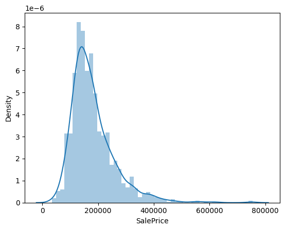
    


## The effect of some main factors 


```python
corr_matrix = train.corr()
fig, ax = plt.subplots()
fig.set_size_inches(16,16)
sns.heatmap(np.absolute(corr_matrix), annot=True)
```


    <AxesSubplot:>


    
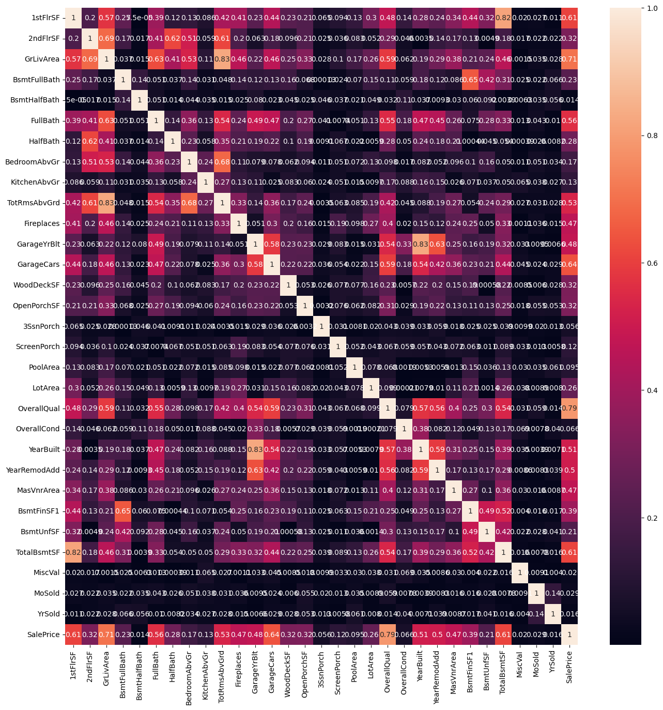
    


```python

```


```python
k=10
cols = corr_matrix.nlargest(k, 'SalePrice')['SalePrice'].index
data = np.corrcoef(train[cols].values.T)
sns.set(font_scale=1.5)
hm = sns.heatmap(data,annot=True, fmt='.3f', annot_kws={'size':10}, yticklabels=cols.values)
plt.show()

```


    
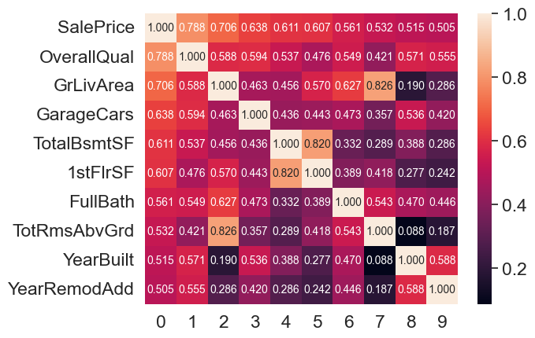
    


```python
#House size
var = 'GrLivArea'
data = pd.concat([train['SalePrice'],train[var]],axis=1)
data.plot.scatter(x=var,y='SalePrice',ylim=(0,800000),color='g')
```


    <AxesSubplot:xlabel='GrLivArea', ylabel='SalePrice'>


    
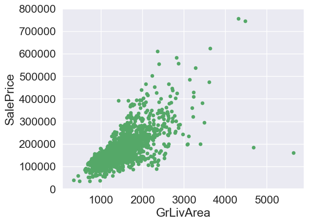
    


```python
#Basement size
var = 'TotalBsmtSF'
data = pd.concat([train['SalePrice'],train[var]],axis=1)
data.plot.scatter(x=var,y='SalePrice',ylim=(0,800000),color='g')
```


    <AxesSubplot:xlabel='TotalBsmtSF', ylabel='SalePrice'>


    
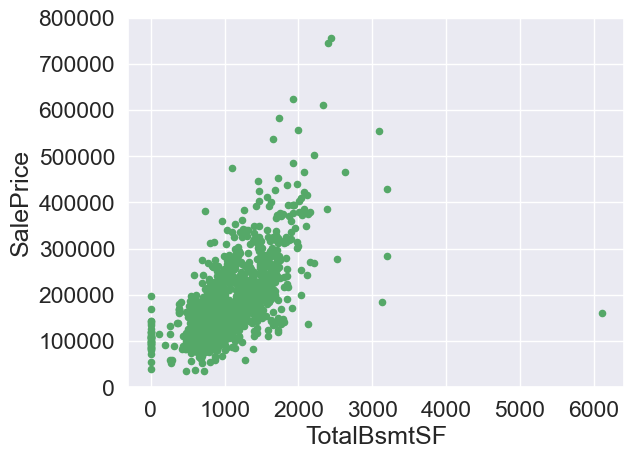
    


```python
#all quality
var = 'OverallQual'
data = pd.concat([train['SalePrice'],train[var]],axis=1)
data.plot.scatter(x=var,y='SalePrice',ylim=(0,800000),color='g')
```


    <AxesSubplot:xlabel='OverallQual', ylabel='SalePrice'>


    
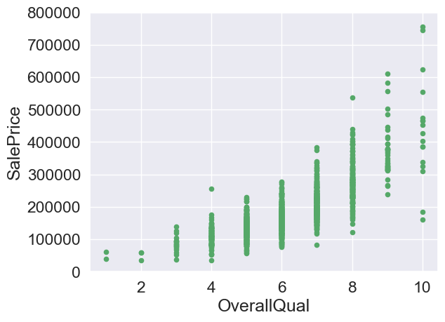
    


```python
#1st floor size
var = '1stFlrSF'
data = pd.concat([train['SalePrice'],train[var]],axis=1)
data.plot.scatter(x=var,y='SalePrice',ylim=(0,800000),color='g')
```


    <AxesSubplot:xlabel='1stFlrSF', ylabel='SalePrice'>


    
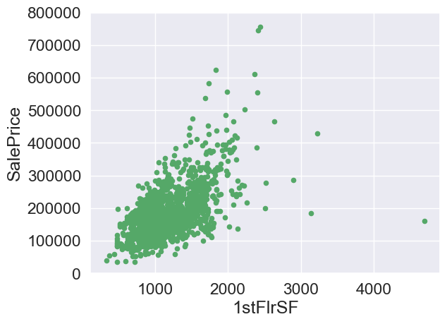
    


```python
var = 'FullBath'
data = pd.concat([train['SalePrice'],train[var]],axis=1)
data.plot.scatter(x=var,y='SalePrice',ylim=(0,800000),color='g')
```


    <AxesSubplot:xlabel='FullBath', ylabel='SalePrice'>


    
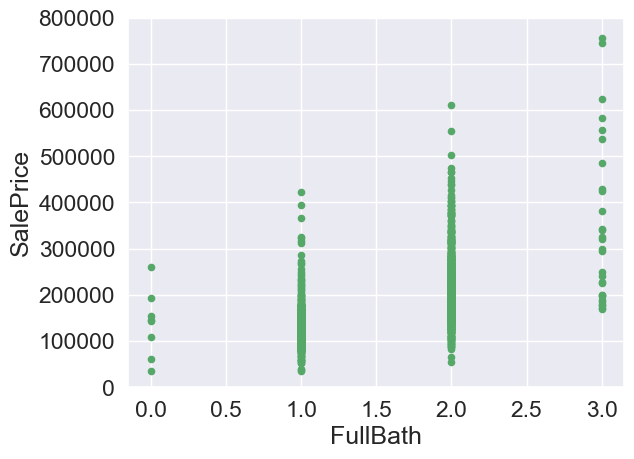
    


```python
#Total square feet of basement area
var = 'TotRmsAbvGrd'
data = pd.concat([train['SalePrice'],train[var]],axis=1)
data.plot.scatter(x=var,y='SalePrice',ylim=(0,800000),color='g')
```


    <AxesSubplot:xlabel='TotRmsAbvGrd', ylabel='SalePrice'>


    
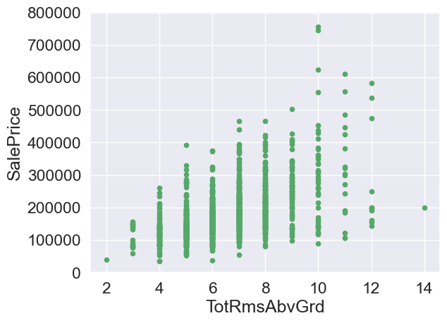
    


```python
var = 'YearBuilt'
data = pd.concat([train['SalePrice'],train[var]],axis=1)
data.plot.scatter(x=var,y='SalePrice',ylim=(0,800000),color='g')
```


    <AxesSubplot:xlabel='YearBuilt', ylabel='SalePrice'>


    
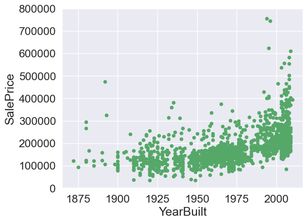
    


```python
# Remodel date
var = 'YearRemodAdd'
data = pd.concat([train['SalePrice'],train[var]],axis=1)
data.plot.scatter(x=var,y='SalePrice',ylim=(0,800000),color='g')
```


    <AxesSubplot:xlabel='YearRemodAdd', ylabel='SalePrice'>


    
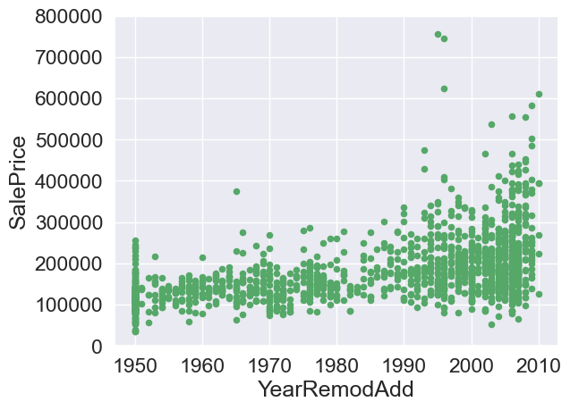
    


## missing values


```python
# count null 

a= train.isnull().sum().sort_values(ascending=False)
a.head(20)
```


    PoolQC          1378
    MiscFeature     1336
    Alley           1297
    Fence           1122
    FireplaceQu      654
    GarageCond        79
    GarageQual        79
    GarageYrBlt       79
    GarageType        79
    GarageFinish      79
    BsmtExposure      36
    BsmtQual          35
    BsmtFinType1      35
    BsmtCond          35
    MasVnrArea         8
    MasVnrType         8
    Electrical         1
    Condition2         0
    BldgType           0
    Exterior1st        0
    dtype: int64


```python
# the percentage of NAN
train.isnull().sum().sort_values(ascending=False) / train.shape[0]
```


    PoolQC         0.994946
    MiscFeature    0.964621
    Alley          0.936462
    Fence          0.810108
    FireplaceQu    0.472202
                     ...   
    Street         0.000000
    HeatingQC      0.000000
    LotShape       0.000000
    LandContour    0.000000
    SalePrice      0.000000
    Length: 71, dtype: float64


## Data pre-processing


```python
# dropping outliers
be_dropped1 = list(train[(train['TotalBsmtSF']>4000) & (train['SalePrice']<300000)].index)
train = train.drop(index=be_dropped1)

be_dropped2 = list(train[(train['GrLivArea']>4000) & (train['SalePrice']<200000)].index)
train = train.drop(index=be_dropped2)

be_dropped3 = list(train[(train['1stFlrSF']>3000) & (train['SalePrice']<200000)].index)
train = train.drop(index=be_dropped3)

be_dropped4 = list(train[(train['FullBath']==3.0) & (train['SalePrice']>700000)].index)
train = train.drop(index=be_dropped4)

be_dropped5 = list(train[(train['TotRmsAbvGrd']==10.0) & (train['SalePrice']>700000)].index)
train = train.drop(index=be_dropped5)

be_dropped6 = list(train[(train['YearBuilt']<1980) & (train['SalePrice']>700000)].index)
train = train.drop(index=be_dropped6)

be_dropped7 = list(train[(train['YearBuilt']<1990) & (train['SalePrice']>700000)].index)
train = train.drop(index=be_dropped7)
```


```python
# Logarithmic transformation log(1+x)
train["SalePrice"]=np.log1p(train["SalePrice"])
tr = train["SalePrice"]

# new distribution
sns.distplot(tr,hist=True, kde=True, fit=norm) #Fitting the standard normal distribution
# mu and sigma
(new_mu,new_sigma) = norm.fit(tr)
print('\n mu = {:.4f} and sigma = {:.4f}\n'.format(new_mu,new_sigma))

# distribution
plt.legend(['($\mu=$ {:.4f} $\sigma =$ {:.4f})'.format(new_mu,new_sigma)])

plt.ylabel('Frequency')
plt.title('SalePrice distribution')

# QQ
fig = plt.figure(figsize = (10,6))
res = stats.probplot(tr, plot=plt)
plt.show()
```

    
     mu = 12.0216 and sigma = 0.3948
    
    


    
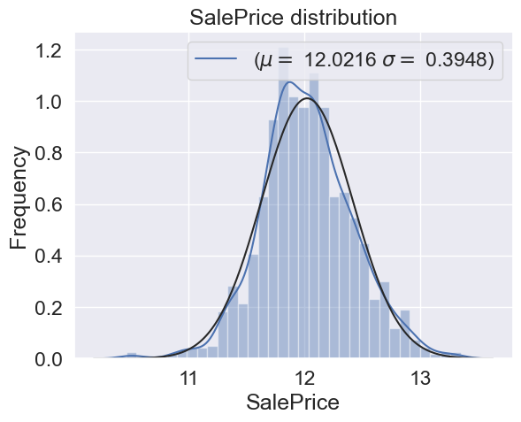
    


    
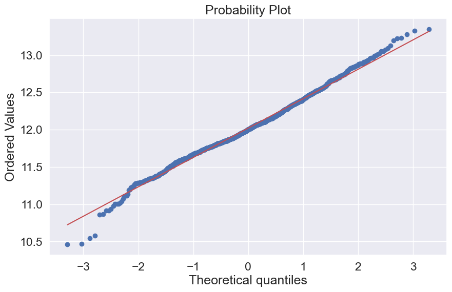
    


```python
ntrain = train.shape[0]
ntest = test.shape[0]
y = train.SalePrice.values
combine_data = pd.concat((train, test)).reset_index(drop=True)
combine_data.drop(['SalePrice'], axis=1, inplace=True)
```

## Solving missing values


```python
combine_data.isnull().sum().sort_values(ascending=False) / combine_data.shape[0]
```


    PoolQC           0.997183
    MiscFeature      0.964789
    Alley            0.931338
    Fence            0.805634
    FireplaceQu      0.487324
                       ...   
    LotShape         0.000000
    LandContour      0.000000
    LotConfig        0.000000
    Neighborhood     0.000000
    SaleCondition    0.000000
    Length: 70, dtype: float64


**Fill with null values**


```python
#I will drop the data if it lost above 80% 
combine_data.drop(columns=['PoolQC','MiscFeature','Alley','Fence'], axis=1, inplace=True)

```


```python
combine_data["FireplaceQu"] = combine_data["FireplaceQu"].fillna("None")

for col in('GarageCond','GarageQual','GarageType','GarageFinish'):
    combine_data[col] = combine_data[col].fillna('None')
    
combine_data['GarageYrBlt']=combine_data['GarageYrBlt'].fillna(0)

combine_data['GarageCars']=combine_data['GarageCars'].fillna(0)

for col in('BsmtFinSF1','BsmtFullBath','BsmtHalfBath','BsmtUnfSF','TotalBsmtSF'):
    combine_data[col] = combine_data[col].fillna(0)
    
for col in('BsmtQual','BsmtCond','BsmtExposure','BsmtFinType1'):
    combine_data[col] = combine_data[col].fillna('None')
    
combine_data['MasVnrArea'] = combine_data["MasVnrArea"].fillna(0)

combine_data['MasVnrType'] = combine_data["MasVnrType"].fillna("None")

# combine_data['MSZoning'].mode()
combine_data['MSZoning'] = combine_data['MSZoning'].fillna(combine_data['MSZoning'].mode()[0])

combine_data["Functional"] = combine_data["Functional"].fillna("Typ")

combine_data['Electrical'] = combine_data['Electrical'].fillna(combine_data['Electrical'].mode()[0])
```


```python
combine_data['KitchenQual'] = combine_data['KitchenQual'].fillna(combine_data['KitchenQual'].mode()[0])
```


```python
combine_data['Exterior1st'] = combine_data['Exterior1st'].fillna(combine_data['Exterior1st'].mode()[0])
combine_data['Exterior2nd'] = combine_data['Exterior2nd'].fillna(combine_data['Exterior2nd'].mode()[0])
```


```python
combine_data['SaleType'] = combine_data['SaleType'].fillna(combine_data['SaleType'].mode()[0])
```


```python
#All Utilities are same
combine_data = combine_data.drop(['Utilities'], axis=1)
```


```python
combine_data.isnull().sum().sort_values(ascending=False)
```


    Heating          0
    LotShape         0
    LotConfig        0
    Neighborhood     0
    Condition1       0
                    ..
    3SsnPorch        0
    ScreenPorch      0
    PoolArea         0
    MSZoning         0
    SaleCondition    0
    Length: 65, dtype: int64


```python
# Here are three discontinuous Values I also set them as categry values
combine_data['OverallCond']=combine_data['OverallCond'].astype(str)
combine_data['YrSold']=combine_data['YrSold'].astype(str)
combine_data['MoSold']=combine_data['MoSold'].astype(str)
```


```python
from sklearn.preprocessing import LabelEncoder
cols = ['Heating','HeatingQC','CentralAir','ExterCond','Foundation','BsmtQual','BsmtCond', 'BsmtExposure', 'BsmtFinType1','Electrical','KitchenQual','Functional','FireplaceQu',
        'GarageType','GarageFinish','GarageQual','GarageCond','PavedDrive','MSZoning','Street','HouseStyle','RoofStyle','Exterior1st','Exterior2nd','LotShape','LandContour','LotConfig',
        'Neighborhood','Condition1','Condition2','BldgType','MasVnrType','ExterQual', 'SaleType', 'SaleCondition']

for c in cols:
    lbl=LabelEncoder()
    lbl.fit(list(combine_data[c].values))
    combine_data[c]=lbl.transform(list(combine_data[c].values))

# print("Shape all_data:{}".format(combine_data.shape))
```


```python
# Add a new feature
combine_data['TotalSF'] = combine_data['TotalBsmtSF']+combine_data['1stFlrSF']+combine_data['2ndFlrSF']
```


```python
from scipy.stats import norm,skew

numeric_features=combine_data.dtypes[combine_data.dtypes !='object'].index
```

**Box-Cox transform**


```python
# the coding method is a reference 
s_f=combine_data[numeric_features].apply(lambda x : (x.dropna()).skew())
s_f=s_f.sort_values(ascending=False)
sks = pd.DataFrame({'Skew':s_f})
# skewness.head(10)
sks = sks[abs(sks)>0.75]
sks.dropna()

from scipy.special import boxcox1p
s_f=sks.index
lam=0.15  #lambda 
for i in s_f:
    combine_data[i]=boxcox1p(combine_data[i], lam)
```


```python
sks.skew
```


    <bound method NDFrame._add_numeric_operations.<locals>.skew of                   Skew
    MiscVal      21.705973
    PoolArea     18.467353
    LotArea      13.179781
    Heating      11.997265
    Condition2   11.689749
    ...                ...
    GarageCond   -3.575216
    SaleType     -3.700801
    GarageYrBlt  -3.874325
    Functional   -4.056136
    Street      -15.982976
    
    [63 rows x 1 columns]>


# Classification models

**split train and test**


```python
train = combine_data[:ntrain]
test = combine_data[ntrain:]
```


```python
from sklearn.model_selection import train_test_split
# Build training and testing
X = train 
y = y# SalePrice

# split
X_train, X_test, y_train, y_test = train_test_split(X, y, test_size=0.3, shuffle=True) 
```

## 1.Linear Regression

Using Linear Regression for classification.


```python
from sklearn.linear_model import LinearRegression
from sklearn.metrics import mean_absolute_error
from sklearn import metrics

LiR = LinearRegression()
LiR.fit(X_train, y_train) # test
y_pred = LiR.predict(X_test) # predict

print('Linear Regression model')
print('MAE1:',metrics.mean_absolute_error(y_test, y_pred))
print('MSE1:',metrics.mean_squared_error(y_test, y_pred))
print('RMSE1:',np.sqrt(metrics.mean_squared_error(y_test, y_pred)))
```

    Linear Regression model
    MAE1: 0.08774504644878327
    MSE1: 0.01472972231383181
    RMSE1: 0.12136606739048526
    

## 2.Decision Tree Regressor


```python
from sklearn.tree import DecisionTreeRegressor
# define a tree
dtr = DecisionTreeRegressor()

# train the model
dtr.fit(X_train, y_train) # test
y_pred2 = dtr.predict(X_test) # predict

# y_test = np.expm1(y_test)
# y_pred = np.expm1(y_pred)

print('Decision Tree Regressor')
print('MAE2:',metrics.mean_absolute_error(y_test, y_pred2))
print('MSE2:',metrics.mean_squared_error(y_test, y_pred2))
print('RMSE2:',np.sqrt(metrics.mean_squared_error(y_test, y_pred2)))
```

    Decision Tree Regressor
    MAE2: 0.14181146390019048
    MSE2: 0.03915691401694715
    RMSE2: 0.1978810602785096
    

## 3.RandomForestRegressor


```python
from sklearn.ensemble import RandomForestRegressor
GBoost = RandomForestRegressor()

GBoost.fit(X_train,y_train)
y_pred3 = GBoost.predict(X_test)

print('RandomForestRegressor')
print('MAE3:',metrics.mean_absolute_error(y_test, y_pred3))
print('MSE3:',metrics.mean_squared_error(y_test, y_pred3))
print('RMSE3:',np.sqrt(metrics.mean_squared_error(y_test, y_pred3)))
```

    RandomForestRegressor
    MAE3: 0.08930294939427963
    MSE3: 0.01701107821173966
    RMSE3: 0.13042652418791073
    

## 4.GBoost


```python
from sklearn.ensemble import GradientBoostingRegressor
GBoost = GradientBoostingRegressor()

GBoost.fit(X_train,y_train)
y_pred4 = GBoost.predict(X_test)

print('GBoost')
print('MAE4:',metrics.mean_absolute_error(y_test, y_pred4))
print('MSE4:',metrics.mean_squared_error(y_test, y_pred4))
print('RMSE4:',np.sqrt(metrics.mean_squared_error(y_test, y_pred4)))
```

    GBoost
    MAE4: 0.08377438102922147
    MSE4: 0.015404937664876545
    RMSE4: 0.1241166292842202
    

# select Linear


```python
LiR.fit(X, y) # test in the whole set

test_pred = LiR.predict(test.values)
result_df = pd.DataFrame(columns=['SalePrice'])

result_df['SalePrice'] = test_pred
result_df = np.expm1(result_df)

result_df.to_csv('LiR_base_model_price.csv', index=None, header=True)
```


```python
result_df['SalePrice'].plot(figsize=(16,8))
```


    <AxesSubplot:>


    
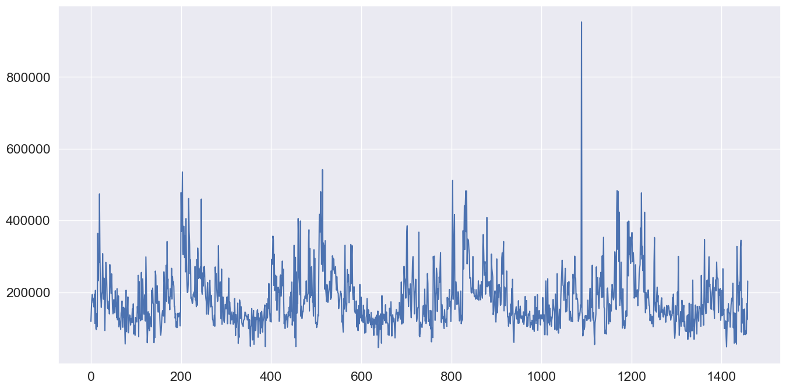
    


```python

```
