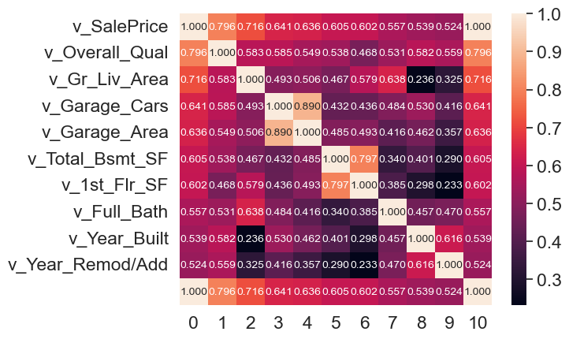
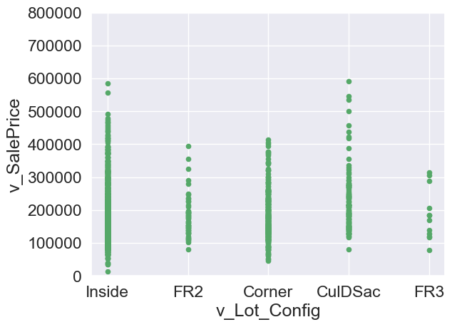

## housing2 -- drop price


```python
import pandas as pd
import numpy as np
from sklearn.model_selection import train_test_split

# load data and split off X and y
housing = pd.read_csv('input_data2/housing_train.csv')

```


```python
housing.describe()
```


<div>
<style scoped>
    .dataframe tbody tr th:only-of-type {
        vertical-align: middle;
    }

    .dataframe tbody tr th {
        vertical-align: top;
    }

    .dataframe thead th {
        text-align: right;
    }
</style>
<table border="1" class="dataframe">
  <thead>
    <tr style="text-align: right;">
      <th></th>
      <th>v_MS_SubClass</th>
      <th>v_Lot_Frontage</th>
      <th>v_Lot_Area</th>
      <th>v_Overall_Qual</th>
      <th>v_Overall_Cond</th>
      <th>v_Year_Built</th>
      <th>v_Year_Remod/Add</th>
      <th>v_Mas_Vnr_Area</th>
      <th>v_BsmtFin_SF_1</th>
      <th>v_BsmtFin_SF_2</th>
      <th>...</th>
      <th>v_Wood_Deck_SF</th>
      <th>v_Open_Porch_SF</th>
      <th>v_Enclosed_Porch</th>
      <th>v_3Ssn_Porch</th>
      <th>v_Screen_Porch</th>
      <th>v_Pool_Area</th>
      <th>v_Misc_Val</th>
      <th>v_Mo_Sold</th>
      <th>v_Yr_Sold</th>
      <th>v_SalePrice</th>
    </tr>
  </thead>
  <tbody>
    <tr>
      <th>count</th>
      <td>1941.000000</td>
      <td>1620.000000</td>
      <td>1941.000000</td>
      <td>1941.000000</td>
      <td>1941.000000</td>
      <td>1941.000000</td>
      <td>1941.000000</td>
      <td>1923.000000</td>
      <td>1940.000000</td>
      <td>1940.000000</td>
      <td>...</td>
      <td>1941.000000</td>
      <td>1941.000000</td>
      <td>1941.000000</td>
      <td>1941.000000</td>
      <td>1941.000000</td>
      <td>1941.000000</td>
      <td>1941.000000</td>
      <td>1941.000000</td>
      <td>1941.000000</td>
      <td>1941.000000</td>
    </tr>
    <tr>
      <th>mean</th>
      <td>58.088614</td>
      <td>69.301235</td>
      <td>10284.770222</td>
      <td>6.113344</td>
      <td>5.568264</td>
      <td>1971.321999</td>
      <td>1984.073158</td>
      <td>104.846074</td>
      <td>436.986598</td>
      <td>49.247938</td>
      <td>...</td>
      <td>92.458011</td>
      <td>49.157135</td>
      <td>22.947965</td>
      <td>2.249871</td>
      <td>16.249871</td>
      <td>3.386399</td>
      <td>52.553838</td>
      <td>6.431221</td>
      <td>2006.998454</td>
      <td>182033.238022</td>
    </tr>
    <tr>
      <th>std</th>
      <td>42.946015</td>
      <td>23.978101</td>
      <td>7832.295527</td>
      <td>1.401594</td>
      <td>1.087465</td>
      <td>30.209933</td>
      <td>20.837338</td>
      <td>184.982611</td>
      <td>457.815715</td>
      <td>169.555232</td>
      <td>...</td>
      <td>127.020523</td>
      <td>70.296277</td>
      <td>65.249307</td>
      <td>22.416832</td>
      <td>56.748086</td>
      <td>43.695267</td>
      <td>616.064459</td>
      <td>2.745199</td>
      <td>0.801736</td>
      <td>80407.100395</td>
    </tr>
    <tr>
      <th>min</th>
      <td>20.000000</td>
      <td>21.000000</td>
      <td>1470.000000</td>
      <td>1.000000</td>
      <td>1.000000</td>
      <td>1872.000000</td>
      <td>1950.000000</td>
      <td>0.000000</td>
      <td>0.000000</td>
      <td>0.000000</td>
      <td>...</td>
      <td>0.000000</td>
      <td>0.000000</td>
      <td>0.000000</td>
      <td>0.000000</td>
      <td>0.000000</td>
      <td>0.000000</td>
      <td>0.000000</td>
      <td>1.000000</td>
      <td>2006.000000</td>
      <td>13100.000000</td>
    </tr>
    <tr>
      <th>25%</th>
      <td>20.000000</td>
      <td>58.000000</td>
      <td>7420.000000</td>
      <td>5.000000</td>
      <td>5.000000</td>
      <td>1953.000000</td>
      <td>1965.000000</td>
      <td>0.000000</td>
      <td>0.000000</td>
      <td>0.000000</td>
      <td>...</td>
      <td>0.000000</td>
      <td>0.000000</td>
      <td>0.000000</td>
      <td>0.000000</td>
      <td>0.000000</td>
      <td>0.000000</td>
      <td>0.000000</td>
      <td>5.000000</td>
      <td>2006.000000</td>
      <td>130000.000000</td>
    </tr>
    <tr>
      <th>50%</th>
      <td>50.000000</td>
      <td>68.000000</td>
      <td>9450.000000</td>
      <td>6.000000</td>
      <td>5.000000</td>
      <td>1973.000000</td>
      <td>1993.000000</td>
      <td>0.000000</td>
      <td>361.500000</td>
      <td>0.000000</td>
      <td>...</td>
      <td>0.000000</td>
      <td>28.000000</td>
      <td>0.000000</td>
      <td>0.000000</td>
      <td>0.000000</td>
      <td>0.000000</td>
      <td>0.000000</td>
      <td>6.000000</td>
      <td>2007.000000</td>
      <td>161900.000000</td>
    </tr>
    <tr>
      <th>75%</th>
      <td>70.000000</td>
      <td>80.000000</td>
      <td>11631.000000</td>
      <td>7.000000</td>
      <td>6.000000</td>
      <td>2001.000000</td>
      <td>2004.000000</td>
      <td>168.000000</td>
      <td>735.250000</td>
      <td>0.000000</td>
      <td>...</td>
      <td>168.000000</td>
      <td>72.000000</td>
      <td>0.000000</td>
      <td>0.000000</td>
      <td>0.000000</td>
      <td>0.000000</td>
      <td>0.000000</td>
      <td>8.000000</td>
      <td>2008.000000</td>
      <td>215000.000000</td>
    </tr>
    <tr>
      <th>max</th>
      <td>190.000000</td>
      <td>313.000000</td>
      <td>164660.000000</td>
      <td>10.000000</td>
      <td>9.000000</td>
      <td>2008.000000</td>
      <td>2009.000000</td>
      <td>1600.000000</td>
      <td>5644.000000</td>
      <td>1474.000000</td>
      <td>...</td>
      <td>1424.000000</td>
      <td>742.000000</td>
      <td>1012.000000</td>
      <td>407.000000</td>
      <td>576.000000</td>
      <td>800.000000</td>
      <td>17000.000000</td>
      <td>12.000000</td>
      <td>2008.000000</td>
      <td>755000.000000</td>
    </tr>
  </tbody>
</table>
<p>8 rows × 37 columns</p>
</div>


## correlation analysis  -- housing3


```python
housing3 = housing
housing3 = housing3.fillna(housing3.mean())
y=housing['v_SalePrice']
```

    C:\Users\Y1733\AppData\Local\Temp\ipykernel_4892\3885830147.py:2: FutureWarning: Dropping of nuisance columns in DataFrame reductions (with 'numeric_only=None') is deprecated; in a future version this will raise TypeError.  Select only valid columns before calling the reduction.
      housing3 = housing3.fillna(housing3.mean())
    


```python
import pandas as pd
import numpy as np
import matplotlib.pyplot as plt
import seaborn as sns
import warnings
from sklearn.model_selection import train_test_split
warnings.filterwarnings('ignore')


# calculate the correlation matrix
corr_matrix = housing3.corr()

# get the top k features that are most correlated with the target variable
k = 10
cols = corr_matrix.nlargest(k, 'v_SalePrice')['v_SalePrice'].index

# calculate the correlation coefficients between the top k features and the target variable
data = np.corrcoef(housing3[cols].values.T, y)

# create the heatmap
sns.set(font_scale=1.5)
hm = sns.heatmap(data, annot=True, fmt='.3f', annot_kws={'size':10}, yticklabels=cols.values)
plt.show()
```


    

    


## Data pre-processing

- Drop outliers


```python
housing.isnull().sum().sort_values(ascending=False) / housing.shape[0]
```


    v_Pool_QC         0.993302
    v_Misc_Feature    0.967543
    v_Alley           0.929933
    v_Fence           0.811953
    v_Fireplace_Qu    0.484286
                        ...   
    v_MS_SubClass     0.000000
    v_Central_Air     0.000000
    v_1st_Flr_SF      0.000000
    v_2nd_Flr_SF      0.000000
    v_SalePrice       0.000000
    Length: 81, dtype: float64


```python
#I will drop the data if it lost above 80% 
housing.drop(columns=['v_Pool_QC','v_Misc_Feature','v_Alley','v_Fence'], axis=1, inplace=True)
```


```python
# dropping outliers
be_dropped1 = list(housing[(housing['v_Lot_Area']>100000) & (housing['v_SalePrice']<400000)].index)
housing = housing.drop(index=be_dropped1)

be_dropped2 = list(housing[(housing['v_Garage_Area']>750) & (housing['v_SalePrice']>600000)].index)
housing = housing.drop(index=be_dropped2)

be_dropped3 = list(housing[(housing['v_Mas_Vnr_Area']>1000) & (housing['v_SalePrice']>600000)].index)
housing = housing.drop(index=be_dropped3)

be_dropped4 = list(housing[(housing['v_TotRms_AbvGrd']==10.0) & (housing['v_SalePrice']>700000)].index)
housing = housing.drop(index=be_dropped4)

be_dropped5 = list(housing[(housing['v_Garage_Yr_Blt']>1950) & (housing['v_SalePrice']>700000)].index)
housing = housing.drop(index=be_dropped5)

be_dropped6 = list(housing[(housing['v_Year_Built']<1950) & (housing['v_SalePrice']>300000)].index)
housing = housing.drop(index=be_dropped6)

be_dropped7 = list(housing[(housing['v_Year_Built']>1975) & (housing['v_SalePrice']>700000)].index)
housing = housing.drop(index=be_dropped7)

be_dropped8 = list(housing[(housing['v_Garage_Yr_Blt']>2050) & (housing['v_SalePrice']<300000)].index)
housing = housing.drop(index=be_dropped8)
```


```python
var = 'v_Lot_Config'
data = pd.concat([housing['v_SalePrice'],housing[var]],axis=1)
data.plot.scatter(x=var,y='v_SalePrice',ylim=(0,800000),color='g')
```


    <AxesSubplot: xlabel='v_Lot_Config', ylabel='v_SalePrice'>


    

    


- Fill with null values


```python
housing.isnull().sum().sort_values(ascending=False)
```


    v_Fireplace_Qu     939
    v_Lot_Frontage     316
    v_Garage_Cond      107
    v_Garage_Yr_Blt    107
    v_Garage_Finish    107
                      ... 
    v_MS_SubClass        0
    v_Heating_QC         0
    v_Central_Air        0
    v_1st_Flr_SF         0
    v_SalePrice          0
    Length: 77, dtype: int64


### housing4 -- log(v_price)


```python
# create test set for use later - notice the (random_state=rng)

housing4 = housing
y = np.log(housing4.v_SalePrice)
rng = np.random.RandomState(0)
X_train, X_test, y_train, y_test = train_test_split(housing4, y, random_state=rng)
```


```python
from sklearn.pipeline import make_pipeline 
from sklearn.compose import ColumnTransformer, make_column_selector
from sklearn.preprocessing import StandardScaler, OneHotEncoder
from sklearn.impute import SimpleImputer
from sklearn.metrics import r2_score

from df_after_transform import df_after_transform
import pandas as pd
import matplotlib.pyplot as plt

from sklearn.linear_model import LassoCV
from sklearn.model_selection import KFold, cross_validate, GridSearchCV

```


```python
numer_pipe = make_pipeline(SimpleImputer(), 
                           StandardScaler())
cat_pipe   = make_pipeline(OneHotEncoder()) #handle_unknown='ignore'

preproc_pipe = ColumnTransformer(
    [ 
    # numerical vars
    ("num_impute", numer_pipe, make_column_selector(dtype_include=np.number)),
    # categorical vars  
    ("cat_trans", cat_pipe, ['v_Sale_Condition'])   
    ]
    , remainder = 'drop'
)
```


```python
# # this is the "new" way to see the output: set_config(transform_output="pandas") 
#     # mentioned and shown here: https://ledatascifi.github.io/ledatascifi-2023/content/05/04e_pipelines.html

# # in this code, I'm just showing you one "feature" and implementing one necessary workaround
#     # feature: with config_context() =. after this cell, pipelines won't output data in pandas (it's slower)
#     # workaround: the pipeline by default makes sparse numpy arrays, so I tell it not to via set_params()

# from sklearn import config_context

# with config_context(transform_output="pandas"):
#     preproc_df = (preproc_pipe
#                  .set_params(cat_trans__onehotencoder__sparse_output=False)
#                  .fit_transform(X_train)
#                 )
    
# preproc_df.describe().T.round(2)    
```

## Model analysis

- Lasso


```python
from sklearn.linear_model import Lasso

lasso_pipe = make_pipeline(preproc_pipe,
                           Lasso(alpha=.3))

score_alpha_0_3 = cross_validate(lasso_pipe,X_train,y_train,
               cv=KFold(10), scoring='r2')['test_score'].mean().round(5)
```


```python

search_alphas = list(np.linspace(0.001,0.007,7))+\
                list(np.linspace(0.0072,0.0082,101))+\
                list(np.linspace(0.0085,.02,20))+\
                list(np.linspace(0.02,1,10))
parameters = [ {'lasso__alpha': search_alphas}]

# set up search grid

grid_search1 = GridSearchCV(estimator = lasso_pipe, 
                           param_grid = parameters,
                           scoring = 'r2',
                           cv = KFold(10))

results1 = grid_search1.fit(X_train,y_train)
```


```python
results2 = make_pipeline(preproc_pipe,LassoCV(cv = KFold(10)))
results2.fit(X_train,y_train)
```


<style>#sk-container-id-1 {color: black;background-color: white;}#sk-container-id-1 pre{padding: 0;}#sk-container-id-1 div.sk-toggleable {background-color: white;}#sk-container-id-1 label.sk-toggleable__label {cursor: pointer;display: block;width: 100%;margin-bottom: 0;padding: 0.3em;box-sizing: border-box;text-align: center;}#sk-container-id-1 label.sk-toggleable__label-arrow:before {content: "▸";float: left;margin-right: 0.25em;color: #696969;}#sk-container-id-1 label.sk-toggleable__label-arrow:hover:before {color: black;}#sk-container-id-1 div.sk-estimator:hover label.sk-toggleable__label-arrow:before {color: black;}#sk-container-id-1 div.sk-toggleable__content {max-height: 0;max-width: 0;overflow: hidden;text-align: left;background-color: #f0f8ff;}#sk-container-id-1 div.sk-toggleable__content pre {margin: 0.2em;color: black;border-radius: 0.25em;background-color: #f0f8ff;}#sk-container-id-1 input.sk-toggleable__control:checked~div.sk-toggleable__content {max-height: 200px;max-width: 100%;overflow: auto;}#sk-container-id-1 input.sk-toggleable__control:checked~label.sk-toggleable__label-arrow:before {content: "▾";}#sk-container-id-1 div.sk-estimator input.sk-toggleable__control:checked~label.sk-toggleable__label {background-color: #d4ebff;}#sk-container-id-1 div.sk-label input.sk-toggleable__control:checked~label.sk-toggleable__label {background-color: #d4ebff;}#sk-container-id-1 input.sk-hidden--visually {border: 0;clip: rect(1px 1px 1px 1px);clip: rect(1px, 1px, 1px, 1px);height: 1px;margin: -1px;overflow: hidden;padding: 0;position: absolute;width: 1px;}#sk-container-id-1 div.sk-estimator {font-family: monospace;background-color: #f0f8ff;border: 1px dotted black;border-radius: 0.25em;box-sizing: border-box;margin-bottom: 0.5em;}#sk-container-id-1 div.sk-estimator:hover {background-color: #d4ebff;}#sk-container-id-1 div.sk-parallel-item::after {content: "";width: 100%;border-bottom: 1px solid gray;flex-grow: 1;}#sk-container-id-1 div.sk-label:hover label.sk-toggleable__label {background-color: #d4ebff;}#sk-container-id-1 div.sk-serial::before {content: "";position: absolute;border-left: 1px solid gray;box-sizing: border-box;top: 0;bottom: 0;left: 50%;z-index: 0;}#sk-container-id-1 div.sk-serial {display: flex;flex-direction: column;align-items: center;background-color: white;padding-right: 0.2em;padding-left: 0.2em;position: relative;}#sk-container-id-1 div.sk-item {position: relative;z-index: 1;}#sk-container-id-1 div.sk-parallel {display: flex;align-items: stretch;justify-content: center;background-color: white;position: relative;}#sk-container-id-1 div.sk-item::before, #sk-container-id-1 div.sk-parallel-item::before {content: "";position: absolute;border-left: 1px solid gray;box-sizing: border-box;top: 0;bottom: 0;left: 50%;z-index: -1;}#sk-container-id-1 div.sk-parallel-item {display: flex;flex-direction: column;z-index: 1;position: relative;background-color: white;}#sk-container-id-1 div.sk-parallel-item:first-child::after {align-self: flex-end;width: 50%;}#sk-container-id-1 div.sk-parallel-item:last-child::after {align-self: flex-start;width: 50%;}#sk-container-id-1 div.sk-parallel-item:only-child::after {width: 0;}#sk-container-id-1 div.sk-dashed-wrapped {border: 1px dashed gray;margin: 0 0.4em 0.5em 0.4em;box-sizing: border-box;padding-bottom: 0.4em;background-color: white;}#sk-container-id-1 div.sk-label label {font-family: monospace;font-weight: bold;display: inline-block;line-height: 1.2em;}#sk-container-id-1 div.sk-label-container {text-align: center;}#sk-container-id-1 div.sk-container {/* jupyter's `normalize.less` sets `[hidden] { display: none; }` but bootstrap.min.css set `[hidden] { display: none !important; }` so we also need the `!important` here to be able to override the default hidden behavior on the sphinx rendered scikit-learn.org. See: https://github.com/scikit-learn/scikit-learn/issues/21755 */display: inline-block !important;position: relative;}#sk-container-id-1 div.sk-text-repr-fallback {display: none;}</style><div id="sk-container-id-1" class="sk-top-container"><div class="sk-text-repr-fallback"><pre>Pipeline(steps=[(&#x27;columntransformer&#x27;,
                 ColumnTransformer(transformers=[(&#x27;num_impute&#x27;,
                                                  Pipeline(steps=[(&#x27;simpleimputer&#x27;,
                                                                   SimpleImputer()),
                                                                  (&#x27;standardscaler&#x27;,
                                                                   StandardScaler())]),
                                                  &lt;sklearn.compose._column_transformer.make_column_selector object at 0x0000023EB1BE4F10&gt;),
                                                 (&#x27;cat_trans&#x27;,
                                                  Pipeline(steps=[(&#x27;onehotencoder&#x27;,
                                                                   OneHotEncoder())]),
                                                  [&#x27;v_Sale_Condition&#x27;])])),
                (&#x27;lassocv&#x27;,
                 LassoCV(cv=KFold(n_splits=10, random_state=None, shuffle=False)))])</pre><b>In a Jupyter environment, please rerun this cell to show the HTML representation or trust the notebook. <br />On GitHub, the HTML representation is unable to render, please try loading this page with nbviewer.org.</b></div><div class="sk-container" hidden><div class="sk-item sk-dashed-wrapped"><div class="sk-label-container"><div class="sk-label sk-toggleable"><input class="sk-toggleable__control sk-hidden--visually" id="sk-estimator-id-1" type="checkbox" ><label for="sk-estimator-id-1" class="sk-toggleable__label sk-toggleable__label-arrow">Pipeline</label><div class="sk-toggleable__content"><pre>Pipeline(steps=[(&#x27;columntransformer&#x27;,
                 ColumnTransformer(transformers=[(&#x27;num_impute&#x27;,
                                                  Pipeline(steps=[(&#x27;simpleimputer&#x27;,
                                                                   SimpleImputer()),
                                                                  (&#x27;standardscaler&#x27;,
                                                                   StandardScaler())]),
                                                  &lt;sklearn.compose._column_transformer.make_column_selector object at 0x0000023EB1BE4F10&gt;),
                                                 (&#x27;cat_trans&#x27;,
                                                  Pipeline(steps=[(&#x27;onehotencoder&#x27;,
                                                                   OneHotEncoder())]),
                                                  [&#x27;v_Sale_Condition&#x27;])])),
                (&#x27;lassocv&#x27;,
                 LassoCV(cv=KFold(n_splits=10, random_state=None, shuffle=False)))])</pre></div></div></div><div class="sk-serial"><div class="sk-item sk-dashed-wrapped"><div class="sk-label-container"><div class="sk-label sk-toggleable"><input class="sk-toggleable__control sk-hidden--visually" id="sk-estimator-id-2" type="checkbox" ><label for="sk-estimator-id-2" class="sk-toggleable__label sk-toggleable__label-arrow">columntransformer: ColumnTransformer</label><div class="sk-toggleable__content"><pre>ColumnTransformer(transformers=[(&#x27;num_impute&#x27;,
                                 Pipeline(steps=[(&#x27;simpleimputer&#x27;,
                                                  SimpleImputer()),
                                                 (&#x27;standardscaler&#x27;,
                                                  StandardScaler())]),
                                 &lt;sklearn.compose._column_transformer.make_column_selector object at 0x0000023EB1BE4F10&gt;),
                                (&#x27;cat_trans&#x27;,
                                 Pipeline(steps=[(&#x27;onehotencoder&#x27;,
                                                  OneHotEncoder())]),
                                 [&#x27;v_Sale_Condition&#x27;])])</pre></div></div></div><div class="sk-parallel"><div class="sk-parallel-item"><div class="sk-item"><div class="sk-label-container"><div class="sk-label sk-toggleable"><input class="sk-toggleable__control sk-hidden--visually" id="sk-estimator-id-3" type="checkbox" ><label for="sk-estimator-id-3" class="sk-toggleable__label sk-toggleable__label-arrow">num_impute</label><div class="sk-toggleable__content"><pre>&lt;sklearn.compose._column_transformer.make_column_selector object at 0x0000023EB1BE4F10&gt;</pre></div></div></div><div class="sk-serial"><div class="sk-item"><div class="sk-serial"><div class="sk-item"><div class="sk-estimator sk-toggleable"><input class="sk-toggleable__control sk-hidden--visually" id="sk-estimator-id-4" type="checkbox" ><label for="sk-estimator-id-4" class="sk-toggleable__label sk-toggleable__label-arrow">SimpleImputer</label><div class="sk-toggleable__content"><pre>SimpleImputer()</pre></div></div></div><div class="sk-item"><div class="sk-estimator sk-toggleable"><input class="sk-toggleable__control sk-hidden--visually" id="sk-estimator-id-5" type="checkbox" ><label for="sk-estimator-id-5" class="sk-toggleable__label sk-toggleable__label-arrow">StandardScaler</label><div class="sk-toggleable__content"><pre>StandardScaler()</pre></div></div></div></div></div></div></div></div><div class="sk-parallel-item"><div class="sk-item"><div class="sk-label-container"><div class="sk-label sk-toggleable"><input class="sk-toggleable__control sk-hidden--visually" id="sk-estimator-id-6" type="checkbox" ><label for="sk-estimator-id-6" class="sk-toggleable__label sk-toggleable__label-arrow">cat_trans</label><div class="sk-toggleable__content"><pre>[&#x27;v_Sale_Condition&#x27;]</pre></div></div></div><div class="sk-serial"><div class="sk-item"><div class="sk-serial"><div class="sk-item"><div class="sk-estimator sk-toggleable"><input class="sk-toggleable__control sk-hidden--visually" id="sk-estimator-id-7" type="checkbox" ><label for="sk-estimator-id-7" class="sk-toggleable__label sk-toggleable__label-arrow">OneHotEncoder</label><div class="sk-toggleable__content"><pre>OneHotEncoder()</pre></div></div></div></div></div></div></div></div></div></div><div class="sk-item"><div class="sk-estimator sk-toggleable"><input class="sk-toggleable__control sk-hidden--visually" id="sk-estimator-id-8" type="checkbox" ><label for="sk-estimator-id-8" class="sk-toggleable__label sk-toggleable__label-arrow">LassoCV</label><div class="sk-toggleable__content"><pre>LassoCV(cv=KFold(n_splits=10, random_state=None, shuffle=False))</pre></div></div></div></div></div></div></div>


```python
# score it on the test sample:
# lasso
y_test_predict1 = results1.predict(X_test)
test_score1 = r2_score(y_test,y_test_predict1)
#lassoCV
y_test_predict2 = results2.predict(X_test)
test_score2 = r2_score(y_test,y_test_predict2)
```


```python
test_score1
```


    0.9556259835469225


```python
test_score2
```


    0.9549760990431752


- Ridge


```python
from sklearn.linear_model import Ridge

ridge_pipe = make_pipeline(preproc_pipe,
                           Ridge(alpha=1))

score_alpha_1 = cross_validate(ridge_pipe, X_train, y_train,
                               cv=KFold(10), scoring='r2')['test_score'].mean().round(5)

search_alphas = list(np.linspace(0.001, 0.007, 7)) + \
                list(np.linspace(0.0072, 0.0082, 101)) + \
                list(np.linspace(0.0085, .02, 20)) + \
                list(np.linspace(0.02, 1, 10))

parameters = [{'ridge__alpha': search_alphas}]

# set up search grid
grid_search3 = GridSearchCV(estimator=ridge_pipe,
                           param_grid=parameters,
                           scoring='r2',
                           cv=KFold(10))

results3 = grid_search3.fit(X_train, y_train)
y_test_predict3 = results3.predict(X_test)
test_score3 = r2_score(y_test,y_test_predict3)
print(test_score3)
```

    0.953722967514708
    

- RandomForestRegressor


```python
from sklearn.ensemble import RandomForestRegressor

rf_pipe = make_pipeline(preproc_pipe,
                        RandomForestRegressor(n_estimators=100, max_depth=5))

score_rf = cross_validate(rf_pipe, X_train, y_train,
                           cv=KFold(10), scoring='r2')['test_score'].mean().round(5)

parameters = {'randomforestregressor__n_estimators': [50, 60, 70],
              'randomforestregressor__max_depth': [1, 3, 5, 7]}

grid_search_rf = GridSearchCV(rf_pipe, parameters, cv=KFold(10), scoring='r2')
results4 = grid_search_rf.fit(X_train, y_train)
y_test_predict4 = results4.predict(X_test)
test_score4 = r2_score(y_test,y_test_predict4)

print(test_score4)

```

    0.9994287697348497
    

- xgboost


```python
# pip install xgboost
```


```python
import xgboost as xgb

xgb_pipe = make_pipeline(preproc_pipe,
                         xgb.XGBRegressor(objective='reg:squarederror'))

score_xgb = cross_validate(xgb_pipe, X_train, y_train,
                            cv=KFold(10), scoring='r2')['test_score'].mean().round(5)

parameters = {'xgbregressor__max_depth': [3, 4, 5, 7],
              'xgbregressor__learning_rate': [0.01, 0.1, 0.2],
              'xgbregressor__n_estimators': [30, 50, 70, 100]}

grid_search_xgb = GridSearchCV(xgb_pipe, parameters, cv=KFold(10), scoring='r2')
results5 = grid_search_xgb.fit(X_train, y_train)
y_test_predict5 = results5.predict(X_test)
test_score5 = r2_score(y_test,y_test_predict5)
print(test_score5)
```

    0.9996334160619932
    


```python
print(results5.best_params_)
```

    {'xgbregressor__learning_rate': 0.1, 'xgbregressor__max_depth': 7, 'xgbregressor__n_estimators': 100}
    

- lightgbm


```python
# pip install lightgbm
```


```python
import lightgbm as lgb

lgb_pipe = make_pipeline(preproc_pipe,
                         lgb.LGBMRegressor(objective='regression'))

score_lgb = cross_validate(lgb_pipe, X_train, y_train,
                           cv=KFold(10), scoring='r2')['test_score'].mean().round(5)

parameters = {'lgbmregressor__max_depth': [3, 5, 7],
              'lgbmregressor__learning_rate': [0.01, 0.1, 0.3],
              'lgbmregressor__n_estimators': [30, 40, 50, 60, 70]}

grid_search_lgb = GridSearchCV(lgb_pipe, parameters, cv=KFold(10), scoring='r2')
results6 = grid_search_lgb.fit(X_train, y_train)
y_test_predict6 = results6.predict(X_test)
test_score6 = r2_score(y_test,y_test_predict6)
print(test_score6)
print(results6.best_params_)
```

    0.9960164797417144
    {'lgbmregressor__learning_rate': 0.1, 'lgbmregressor__max_depth': 7, 'lgbmregressor__n_estimators': 70}
    

## test the holdout


```python
holdout = pd.read_csv("input_data2/housing_holdout.csv")
holdout['v_SalePrice'] = 0
y_pred = results6.predict(holdout)

# Get the ID values for the test data
parcel = holdout['parcel'].values

# Combine the predicted values and ID values into a single DataFrame
predictions = pd.DataFrame({'parecel': parcel, 'v_SalePrice': y_pred})

# Save the predictions to a CSV file
predictions.to_csv('submission/MY_PREDICTIONS.csv', index=False)
```


```python

```
