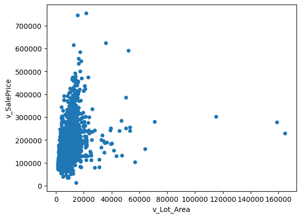

## Part 1: EDA

_Insert cells as needed below to write a short EDA/data section that summarizes the data for someone who has never opened it before._ 
- Answer essential questions about the dataset (observation units, time period, sample size, many of the questions above) 
- Note any issues you have with the data (variable X has problem Y that needs to get addressed before using it in regressions or a prediction model because Z)
- Present any visual results you think are interesting or important


```python
import pandas as pd
import numpy as np
import matplotlib.pyplot as plt
import seaborn as sns
from sklearn.preprocessing import StandardScaler
from statsmodels.formula.api import ols as sm_ols
from statsmodels.iolib.summary2 import summary_col # nicer tables
from eda import insufficient_but_starting_eda

import math
%matplotlib inline
```


```python
housing = pd.read_csv("input_data2/housing_train.csv")
```

### category variables:


```python
category_columns = [col for col in housing.columns if housing[col].dtype == 'object']
print(category_columns)
```

    ['parcel', 'v_MS_Zoning', 'v_Street', 'v_Alley', 'v_Lot_Shape', 'v_Land_Contour', 'v_Utilities', 'v_Lot_Config', 'v_Land_Slope', 'v_Neighborhood', 'v_Condition_1', 'v_Condition_2', 'v_Bldg_Type', 'v_House_Style', 'v_Roof_Style', 'v_Roof_Matl', 'v_Exterior_1st', 'v_Exterior_2nd', 'v_Mas_Vnr_Type', 'v_Exter_Qual', 'v_Exter_Cond', 'v_Foundation', 'v_Bsmt_Qual', 'v_Bsmt_Cond', 'v_Bsmt_Exposure', 'v_BsmtFin_Type_1', 'v_BsmtFin_Type_2', 'v_Heating', 'v_Heating_QC', 'v_Central_Air', 'v_Electrical', 'v_Kitchen_Qual', 'v_Functional', 'v_Fireplace_Qu', 'v_Garage_Type', 'v_Garage_Finish', 'v_Garage_Qual', 'v_Garage_Cond', 'v_Paved_Drive', 'v_Pool_QC', 'v_Fence', 'v_Misc_Feature', 'v_Sale_Type', 'v_Sale_Condition']
    

### continuous variables:
'v_Lot_Frontage', 'v_Lot_Area', 'v_Mas_Vnr_Area', 'v_BsmtFin_F'_, 'v_BsmtFin_SF_2', 'v_Bsmt_Unf_SF', 'v_Total_Bsmt_SF', 'v_1st_Flr_SF', 'v_2nd_Flr_SF', 'v_Low_Qual_Fin_SF', 'v_Gr_Liv_Area', 'v_Garage_Area', 'v_Wood_Deck_SF', 'v_Open_Porch_SF', 'v_Enclosed_Porch', 'v_3Ssn_Porch', 'v_Screen_Porch', 'v_Pool_Area', 'v_3Ssn_Porch', 'v_Screen_Porch', 'v_Pool_Area', 'v_Misc_Val'


```python
# this is my testing code to see all graphs:
# continuous_vars = ['v_Lot_Frontage', 'v_Lot_Area', 'v_Mas_Vnr_Area', 'v_BsmtFin_SF_1' , 'v_BsmtFin_SF_2', 'v_Bsmt_Unf_SF', 'v_Total_Bsmt_SF', 'v_1st_Flr_SF', 
#                 'v_2nd_Flr_SF', 'v_Low_Qual_Fin_SF', 'v_Gr_Liv_Area', 'v_Garage_Area', 'v_Wood_Deck_SF', 'v_Open_Porch_SF', 'v_Enclosed_Porch', 
#                 'v_3Ssn_Porch', 'v_Screen_Porch', 'v_Pool_Area', 'v_3Ssn_Porch', 'v_Screen_Porch', 'v_Pool_Area', 'v_Misc_Val', 'v_SalePrice']

# for var in continuous_vars:
#     plt.scatter(housing[var], housing['v_SalePrice'])
#     plt.xlabel(var)
#     plt.ylabel('v_SalePrice')
#     plt.show()
```


```python
num_rows = len(housing)
print("Number of observation units:", num_rows)
```

    Number of observation units: 1941
    


```python
min_date = housing["v_Year_Built"].min()
max_date = housing["v_Year_Built"].max()
period = (max_date - min_date)
print("Time period:", min_date, "to", max_date, "is", period)
```

    Time period: 1872 to 2008 is 136
    


```python
housing.shape
```


    (1941, 81)


```python
continuous_vars = ['v_Lot_Frontage', 'v_Lot_Area', 'v_Mas_Vnr_Area', 'v_BsmtFin_SF_1' , 'v_BsmtFin_SF_2', 'v_Bsmt_Unf_SF', 'v_Total_Bsmt_SF', 'v_1st_Flr_SF', 
                'v_2nd_Flr_SF', 'v_Low_Qual_Fin_SF', 'v_Gr_Liv_Area', 'v_Garage_Area', 'v_Wood_Deck_SF', 'v_Open_Porch_SF', 'v_Enclosed_Porch', 
                'v_3Ssn_Porch', 'v_Screen_Porch', 'v_Pool_Area', 'v_3Ssn_Porch', 'v_Screen_Porch', 'v_Pool_Area', 'v_Misc_Val', 'v_SalePrice']
insufficient_but_starting_eda(housing[continuous_vars], ['v_SalePrice'])
```

       v_Lot_Frontage  v_Lot_Area  v_Mas_Vnr_Area  v_BsmtFin_SF_1  v_BsmtFin_SF_2  \
    0           107.0       13891           436.0          1400.0             0.0   
    1            98.0       12704           302.0          1012.0             0.0   
    2           114.0       14803           816.0          1636.0             0.0   
    3           126.0       13108             0.0             0.0             0.0   
    4            96.0       12444           426.0          1336.0             0.0   
    
       v_Bsmt_Unf_SF  v_Total_Bsmt_SF  v_1st_Flr_SF  v_2nd_Flr_SF  \
    0          310.0           1710.0          1710             0   
    1          570.0           1582.0          1582             0   
    2          442.0           2078.0          2084             0   
    3            0.0              0.0          1226             0   
    4          596.0           1932.0          1932             0   
    
       v_Low_Qual_Fin_SF  ...  v_Open_Porch_SF  v_Enclosed_Porch  v_3Ssn_Porch  \
    0                  0  ...              102                 0             0   
    1                  0  ...               95                 0             0   
    2                  0  ...               45                 0             0   
    3                  0  ...               24               120             0   
    4                  0  ...               66                 0           304   
    
       v_Screen_Porch  v_Pool_Area  v_3Ssn_Porch  v_Screen_Porch  v_Pool_Area  \
    0               0            0             0               0            0   
    1               0            0             0               0            0   
    2               0            0             0               0            0   
    3             228            0             0             228            0   
    4               0            0           304               0            0   
    
       v_Misc_Val  v_SalePrice  
    0           0       372402  
    1           0       317500  
    2           0       385000  
    3           0       153500  
    4           0       394617  
    
    [5 rows x 23 columns] 
    ---
          v_Lot_Frontage  v_Lot_Area  v_Mas_Vnr_Area  v_BsmtFin_SF_1  \
    1936            79.0       13110           144.0           962.0   
    1937             NaN        7082             0.0             0.0   
    1938            60.0       10800             0.0           664.0   
    1939            55.0        5687             0.0           210.0   
    1940            60.0       12900             0.0          1300.0   
    
          v_BsmtFin_SF_2  v_Bsmt_Unf_SF  v_Total_Bsmt_SF  v_1st_Flr_SF  \
    1936             0.0          191.0           1153.0          1193   
    1937             0.0          686.0            686.0           948   
    1938             0.0          290.0            954.0          1766   
    1939             0.0          570.0            780.0           936   
    1940             0.0            0.0           1300.0          1140   
    
          v_2nd_Flr_SF  v_Low_Qual_Fin_SF  ...  v_Open_Porch_SF  v_Enclosed_Porch  \
    1936             0                  0  ...              153                 0   
    1937           980                  0  ...                0               228   
    1938           648                  0  ...                0                 0   
    1939           780                  0  ...              184                 0   
    1940             0                  0  ...                0               190   
    
          v_3Ssn_Porch  v_Screen_Porch  v_Pool_Area  v_3Ssn_Porch  v_Screen_Porch  \
    1936             0               0            0             0               0   
    1937             0               0            0             0               0   
    1938             0               0            0             0               0   
    1939             0               0            0             0               0   
    1940             0               0            0             0               0   
    
          v_Pool_Area  v_Misc_Val  v_SalePrice  
    1936            0           0       146500  
    1937            0           0       160000  
    1938            0           0       160000  
    1939            0           0       135900  
    1940            0           0        95541  
    
    [5 rows x 23 columns] 
    ---
    Index(['v_Lot_Frontage', 'v_Lot_Area', 'v_Mas_Vnr_Area', 'v_BsmtFin_SF_1',
           'v_BsmtFin_SF_2', 'v_Bsmt_Unf_SF', 'v_Total_Bsmt_SF', 'v_1st_Flr_SF',
           'v_2nd_Flr_SF', 'v_Low_Qual_Fin_SF', 'v_Gr_Liv_Area', 'v_Garage_Area',
           'v_Wood_Deck_SF', 'v_Open_Porch_SF', 'v_Enclosed_Porch', 'v_3Ssn_Porch',
           'v_Screen_Porch', 'v_Pool_Area', 'v_3Ssn_Porch', 'v_Screen_Porch',
           'v_Pool_Area', 'v_Misc_Val', 'v_SalePrice'],
          dtype='object') 
    ---
    The shape is:  (1941, 23) 
    ---
    <class 'pandas.core.frame.DataFrame'>
    RangeIndex: 1941 entries, 0 to 1940
    Data columns (total 23 columns):
     #   Column             Non-Null Count  Dtype  
    ---  ------             --------------  -----  
     0   v_Lot_Frontage     1620 non-null   float64
     1   v_Lot_Area         1941 non-null   int64  
     2   v_Mas_Vnr_Area     1923 non-null   float64
     3   v_BsmtFin_SF_1     1940 non-null   float64
     4   v_BsmtFin_SF_2     1940 non-null   float64
     5   v_Bsmt_Unf_SF      1940 non-null   float64
     6   v_Total_Bsmt_SF    1940 non-null   float64
     7   v_1st_Flr_SF       1941 non-null   int64  
     8   v_2nd_Flr_SF       1941 non-null   int64  
     9   v_Low_Qual_Fin_SF  1941 non-null   int64  
     10  v_Gr_Liv_Area      1941 non-null   int64  
     11  v_Garage_Area      1940 non-null   float64
     12  v_Wood_Deck_SF     1941 non-null   int64  
     13  v_Open_Porch_SF    1941 non-null   int64  
     14  v_Enclosed_Porch   1941 non-null   int64  
     15  v_3Ssn_Porch       1941 non-null   int64  
     16  v_Screen_Porch     1941 non-null   int64  
     17  v_Pool_Area        1941 non-null   int64  
     18  v_3Ssn_Porch       1941 non-null   int64  
     19  v_Screen_Porch     1941 non-null   int64  
     20  v_Pool_Area        1941 non-null   int64  
     21  v_Misc_Val         1941 non-null   int64  
     22  v_SalePrice        1941 non-null   int64  
    dtypes: float64(7), int64(16)
    memory usage: 348.9 KB
    Info: None 
    ---
           v_Lot_Frontage     v_Lot_Area  v_Mas_Vnr_Area  v_BsmtFin_SF_1  \
    count     1620.000000    1941.000000     1923.000000     1940.000000   
    mean        69.301235   10284.770222      104.846074      436.986598   
    std         23.978101    7832.295527      184.982611      457.815715   
    min         21.000000    1470.000000        0.000000        0.000000   
    25%         58.000000    7420.000000        0.000000        0.000000   
    50%         68.000000    9450.000000        0.000000      361.500000   
    75%         80.000000   11631.000000      168.000000      735.250000   
    max        313.000000  164660.000000     1600.000000     5644.000000   
    
           v_BsmtFin_SF_2  v_Bsmt_Unf_SF  v_Total_Bsmt_SF  v_1st_Flr_SF  \
    count     1940.000000    1940.000000      1940.000000   1941.000000   
    mean        49.247938     567.437629      1053.672165   1161.071613   
    std        169.555232     439.600535       438.662147    396.945408   
    min          0.000000       0.000000         0.000000    334.000000   
    25%          0.000000     225.750000       796.750000    886.000000   
    50%          0.000000     474.000000       989.500000   1085.000000   
    75%          0.000000     815.000000      1295.250000   1383.000000   
    max       1474.000000    2153.000000      6110.000000   5095.000000   
    
           v_2nd_Flr_SF  v_Low_Qual_Fin_SF  ...  v_Open_Porch_SF  \
    count   1941.000000        1941.000000  ...      1941.000000   
    mean     340.955178           4.282329  ...        49.157135   
    std      434.242152          42.943917  ...        70.296277   
    min        0.000000           0.000000  ...         0.000000   
    25%        0.000000           0.000000  ...         0.000000   
    50%        0.000000           0.000000  ...        28.000000   
    75%      717.000000           0.000000  ...        72.000000   
    max     2065.000000         697.000000  ...       742.000000   
    
           v_Enclosed_Porch  v_3Ssn_Porch  v_Screen_Porch  v_Pool_Area  \
    count       1941.000000   1941.000000     1941.000000  1941.000000   
    mean          22.947965      2.249871       16.249871     3.386399   
    std           65.249307     22.416832       56.748086    43.695267   
    min            0.000000      0.000000        0.000000     0.000000   
    25%            0.000000      0.000000        0.000000     0.000000   
    50%            0.000000      0.000000        0.000000     0.000000   
    75%            0.000000      0.000000        0.000000     0.000000   
    max         1012.000000    407.000000      576.000000   800.000000   
    
           v_3Ssn_Porch  v_Screen_Porch  v_Pool_Area    v_Misc_Val    v_SalePrice  
    count   1941.000000     1941.000000  1941.000000   1941.000000    1941.000000  
    mean       2.249871       16.249871     3.386399     52.553838  182033.238022  
    std       22.416832       56.748086    43.695267    616.064459   80407.100395  
    min        0.000000        0.000000     0.000000      0.000000   13100.000000  
    25%        0.000000        0.000000     0.000000      0.000000  130000.000000  
    50%        0.000000        0.000000     0.000000      0.000000  161900.000000  
    75%        0.000000        0.000000     0.000000      0.000000  215000.000000  
    max      407.000000      576.000000   800.000000  17000.000000  755000.000000  
    
    [8 rows x 23 columns] 
    ---
    v_SalePrice has 820 values and its top 10 most common are:
    140000    26
    135000    23
    145000    21
    130000    21
    155000    18
    120000    16
    170000    15
    250000    14
    160000    14
    127000    14
    Name: v_SalePrice, dtype: int64 
    ---
    


```python
housing.describe()
```


<div>
<style scoped>
    .dataframe tbody tr th:only-of-type {
        vertical-align: middle;
    }

    .dataframe tbody tr th {
        vertical-align: top;
    }

    .dataframe thead th {
        text-align: right;
    }
</style>
<table border="1" class="dataframe">
  <thead>
    <tr style="text-align: right;">
      <th></th>
      <th>v_MS_SubClass</th>
      <th>v_Lot_Frontage</th>
      <th>v_Lot_Area</th>
      <th>v_Overall_Qual</th>
      <th>v_Overall_Cond</th>
      <th>v_Year_Built</th>
      <th>v_Year_Remod/Add</th>
      <th>v_Mas_Vnr_Area</th>
      <th>v_BsmtFin_SF_1</th>
      <th>v_BsmtFin_SF_2</th>
      <th>...</th>
      <th>v_Wood_Deck_SF</th>
      <th>v_Open_Porch_SF</th>
      <th>v_Enclosed_Porch</th>
      <th>v_3Ssn_Porch</th>
      <th>v_Screen_Porch</th>
      <th>v_Pool_Area</th>
      <th>v_Misc_Val</th>
      <th>v_Mo_Sold</th>
      <th>v_Yr_Sold</th>
      <th>v_SalePrice</th>
    </tr>
  </thead>
  <tbody>
    <tr>
      <th>count</th>
      <td>1941.000000</td>
      <td>1620.000000</td>
      <td>1941.000000</td>
      <td>1941.000000</td>
      <td>1941.000000</td>
      <td>1941.000000</td>
      <td>1941.000000</td>
      <td>1923.000000</td>
      <td>1940.000000</td>
      <td>1940.000000</td>
      <td>...</td>
      <td>1941.000000</td>
      <td>1941.000000</td>
      <td>1941.000000</td>
      <td>1941.000000</td>
      <td>1941.000000</td>
      <td>1941.000000</td>
      <td>1941.000000</td>
      <td>1941.000000</td>
      <td>1941.000000</td>
      <td>1941.000000</td>
    </tr>
    <tr>
      <th>mean</th>
      <td>58.088614</td>
      <td>69.301235</td>
      <td>10284.770222</td>
      <td>6.113344</td>
      <td>5.568264</td>
      <td>1971.321999</td>
      <td>1984.073158</td>
      <td>104.846074</td>
      <td>436.986598</td>
      <td>49.247938</td>
      <td>...</td>
      <td>92.458011</td>
      <td>49.157135</td>
      <td>22.947965</td>
      <td>2.249871</td>
      <td>16.249871</td>
      <td>3.386399</td>
      <td>52.553838</td>
      <td>6.431221</td>
      <td>2006.998454</td>
      <td>182033.238022</td>
    </tr>
    <tr>
      <th>std</th>
      <td>42.946015</td>
      <td>23.978101</td>
      <td>7832.295527</td>
      <td>1.401594</td>
      <td>1.087465</td>
      <td>30.209933</td>
      <td>20.837338</td>
      <td>184.982611</td>
      <td>457.815715</td>
      <td>169.555232</td>
      <td>...</td>
      <td>127.020523</td>
      <td>70.296277</td>
      <td>65.249307</td>
      <td>22.416832</td>
      <td>56.748086</td>
      <td>43.695267</td>
      <td>616.064459</td>
      <td>2.745199</td>
      <td>0.801736</td>
      <td>80407.100395</td>
    </tr>
    <tr>
      <th>min</th>
      <td>20.000000</td>
      <td>21.000000</td>
      <td>1470.000000</td>
      <td>1.000000</td>
      <td>1.000000</td>
      <td>1872.000000</td>
      <td>1950.000000</td>
      <td>0.000000</td>
      <td>0.000000</td>
      <td>0.000000</td>
      <td>...</td>
      <td>0.000000</td>
      <td>0.000000</td>
      <td>0.000000</td>
      <td>0.000000</td>
      <td>0.000000</td>
      <td>0.000000</td>
      <td>0.000000</td>
      <td>1.000000</td>
      <td>2006.000000</td>
      <td>13100.000000</td>
    </tr>
    <tr>
      <th>25%</th>
      <td>20.000000</td>
      <td>58.000000</td>
      <td>7420.000000</td>
      <td>5.000000</td>
      <td>5.000000</td>
      <td>1953.000000</td>
      <td>1965.000000</td>
      <td>0.000000</td>
      <td>0.000000</td>
      <td>0.000000</td>
      <td>...</td>
      <td>0.000000</td>
      <td>0.000000</td>
      <td>0.000000</td>
      <td>0.000000</td>
      <td>0.000000</td>
      <td>0.000000</td>
      <td>0.000000</td>
      <td>5.000000</td>
      <td>2006.000000</td>
      <td>130000.000000</td>
    </tr>
    <tr>
      <th>50%</th>
      <td>50.000000</td>
      <td>68.000000</td>
      <td>9450.000000</td>
      <td>6.000000</td>
      <td>5.000000</td>
      <td>1973.000000</td>
      <td>1993.000000</td>
      <td>0.000000</td>
      <td>361.500000</td>
      <td>0.000000</td>
      <td>...</td>
      <td>0.000000</td>
      <td>28.000000</td>
      <td>0.000000</td>
      <td>0.000000</td>
      <td>0.000000</td>
      <td>0.000000</td>
      <td>0.000000</td>
      <td>6.000000</td>
      <td>2007.000000</td>
      <td>161900.000000</td>
    </tr>
    <tr>
      <th>75%</th>
      <td>70.000000</td>
      <td>80.000000</td>
      <td>11631.000000</td>
      <td>7.000000</td>
      <td>6.000000</td>
      <td>2001.000000</td>
      <td>2004.000000</td>
      <td>168.000000</td>
      <td>735.250000</td>
      <td>0.000000</td>
      <td>...</td>
      <td>168.000000</td>
      <td>72.000000</td>
      <td>0.000000</td>
      <td>0.000000</td>
      <td>0.000000</td>
      <td>0.000000</td>
      <td>0.000000</td>
      <td>8.000000</td>
      <td>2008.000000</td>
      <td>215000.000000</td>
    </tr>
    <tr>
      <th>max</th>
      <td>190.000000</td>
      <td>313.000000</td>
      <td>164660.000000</td>
      <td>10.000000</td>
      <td>9.000000</td>
      <td>2008.000000</td>
      <td>2009.000000</td>
      <td>1600.000000</td>
      <td>5644.000000</td>
      <td>1474.000000</td>
      <td>...</td>
      <td>1424.000000</td>
      <td>742.000000</td>
      <td>1012.000000</td>
      <td>407.000000</td>
      <td>576.000000</td>
      <td>800.000000</td>
      <td>17000.000000</td>
      <td>12.000000</td>
      <td>2008.000000</td>
      <td>755000.000000</td>
    </tr>
  </tbody>
</table>
<p>8 rows × 37 columns</p>
</div>


```python
missing_values = housing.isna()

has_missing_values = missing_values.any()

# Use Boolean indexes to find columns containing missing values
columns_with_missing_values = housing.columns[has_missing_values].tolist()
columns_with_missing_values
```


    ['v_Lot_Frontage',
     'v_Alley',
     'v_Mas_Vnr_Type',
     'v_Mas_Vnr_Area',
     'v_Bsmt_Qual',
     'v_Bsmt_Cond',
     'v_Bsmt_Exposure',
     'v_BsmtFin_Type_1',
     'v_BsmtFin_SF_1',
     'v_BsmtFin_Type_2',
     'v_BsmtFin_SF_2',
     'v_Bsmt_Unf_SF',
     'v_Total_Bsmt_SF',
     'v_Electrical',
     'v_Bsmt_Full_Bath',
     'v_Bsmt_Half_Bath',
     'v_Fireplace_Qu',
     'v_Garage_Type',
     'v_Garage_Yr_Blt',
     'v_Garage_Finish',
     'v_Garage_Cars',
     'v_Garage_Area',
     'v_Garage_Qual',
     'v_Garage_Cond',
     'v_Pool_QC',
     'v_Fence',
     'v_Misc_Feature']


```python
housing['v_SalePrice'].describe()
```


    count      1941.000000
    mean     182033.238022
    std       80407.100395
    min       13100.000000
    25%      130000.000000
    50%      161900.000000
    75%      215000.000000
    max      755000.000000
    Name: v_SalePrice, dtype: float64


```python
sns.displot(housing['v_SalePrice'])
```


    <seaborn.axisgrid.FacetGrid at 0x1d508bce580>


    

    


```python
print("Skewness: %f" % housing['v_SalePrice'].skew())
print("Kurtosis: %f" % housing['v_SalePrice'].kurt())
```

    Skewness: 1.770820
    Kurtosis: 5.342356
    

saleprice is not a standard normal distribution, so subsequent processing of this data is required


```python
# The relationship between house price and area chart
var = 'v_Lot_Area'
data = pd.concat([housing['v_SalePrice'], housing[var]],axis=1)
data.plot.scatter(x=var, y='v_SalePrice')
```

    D:\Anaconda3\lib\site-packages\pandas\plotting\_matplotlib\core.py:1114: UserWarning: No data for colormapping provided via 'c'. Parameters 'cmap' will be ignored
      scatter = ax.scatter(
    


    <AxesSubplot: xlabel='v_Lot_Area', ylabel='v_SalePrice'>


    

    


```python
# The relationship between house price and area chart
var = 'v_Mas_Vnr_Area'
data = pd.concat([housing['v_SalePrice'], housing[var]],axis=1)
data.plot.scatter(x=var, y='v_SalePrice')
```


    <AxesSubplot: xlabel='v_Mas_Vnr_Area', ylabel='v_SalePrice'>


    

    


```python
# The relationship between house price and basement area chart
var2 = 'v_Total_Bsmt_SF'
data = pd.concat([housing['v_SalePrice'], housing[var2]],axis=1)
data.plot.scatter(x=var2, y='v_SalePrice')
```


    <AxesSubplot: xlabel='v_Total_Bsmt_SF', ylabel='v_SalePrice'>


    

    


```python
sns.boxplot(x='v_House_Style', y='v_SalePrice', data=housing)
```


    <AxesSubplot: xlabel='v_House_Style', ylabel='v_SalePrice'>


    

    


### PART 1: issues with data

- First of all, we can see that there are missing data about many street information, housing structures such as basements, electrical settings, parking garages, etc. Some variables that in my opinion have little reference value can be disregarded if there are many missing values at the same time.

- An observation of the house prices reveals that they still have the characteristics of a normal distribution, although there is a large skewness value of 1.77, which is not a standard normal distribution. I will address this issue for the purpose of subsequent forecasting.

- A visual graph of the relationship between area and house price was selected for display. We can notice there are plenty of missing values and also it is reasonable that house price and area are directly proportional, but we can see some outlier points from the picture. Similarly, outliers were found when I examined the area of the basement

## Part 2: Running Regressions

**Run these regressions on the RAW data, even if you found data issues that you think should be addressed.**

_Insert cells as needed below to run these regressions. Note that $i$ is indexing a given house, and $t$ indexes the year of sale._ 

1. $\text{Sale Price}_{i,t} = \alpha + \beta_1 * \text{v_Lot_Area}$
1. $\text{Sale Price}_{i,t} = \alpha + \beta_1 * log(\text{v_Lot_Area})$
1. $log(\text{Sale Price}_{i,t}) = \alpha + \beta_1 * \text{v_Lot_Area}$
1. $log(\text{Sale Price}_{i,t}) = \alpha + \beta_1 * log(\text{v_Lot_Area})$
1. $log(\text{Sale Price}_{i,t}) = \alpha + \beta_1 * \text{v_Yr_Sold}$
1. $log(\text{Sale Price}_{i,t}) = \alpha + \beta_1 * (\text{v_Yr_Sold==2007})+ \beta_2 * (\text{v_Yr_Sold==2008})$
1. Choose your own adventure: Pick any five variables from the dataset that you think will generate good R2. Use them in a regression of $log(\text{Sale Price}_{i,t})$ 
    - Tip: You can transform/create these five variables however you want, even if it creates extra variables. For example: I'd count Model 6 above as only using one variable: `v_Yr_Sold`.
    - I got an R2 of 0.877 with just "5" variables. How close can you get? I won't be shocked if someone beats that!
    

**Bonus formatting trick:** Instead of reporting all regressions separately, report all seven regressions in a _single_ table using `summary_col`.


### Clean the data and create variables 


```python
housing = (housing
               .assign(l_v_Lot_Area = np.log(housing['v_Lot_Area']),
                       l_v_SalePrice = np.log(housing['v_SalePrice'])
              )
          )
```

### Statsmodels

```
model = sm_ols(<formula>, data=<dataframe>)
result=model.fit()
```


```python
housing
```


<div>
<style scoped>
    .dataframe tbody tr th:only-of-type {
        vertical-align: middle;
    }

    .dataframe tbody tr th {
        vertical-align: top;
    }

    .dataframe thead th {
        text-align: right;
    }
</style>
<table border="1" class="dataframe">
  <thead>
    <tr style="text-align: right;">
      <th></th>
      <th>parcel</th>
      <th>v_MS_SubClass</th>
      <th>v_MS_Zoning</th>
      <th>v_Lot_Frontage</th>
      <th>v_Lot_Area</th>
      <th>v_Street</th>
      <th>v_Alley</th>
      <th>v_Lot_Shape</th>
      <th>v_Land_Contour</th>
      <th>v_Utilities</th>
      <th>...</th>
      <th>v_Fence</th>
      <th>v_Misc_Feature</th>
      <th>v_Misc_Val</th>
      <th>v_Mo_Sold</th>
      <th>v_Yr_Sold</th>
      <th>v_Sale_Type</th>
      <th>v_Sale_Condition</th>
      <th>v_SalePrice</th>
      <th>l_v_Lot_Area</th>
      <th>l_v_SalePrice</th>
    </tr>
  </thead>
  <tbody>
    <tr>
      <th>0</th>
      <td>1056_528110080</td>
      <td>20</td>
      <td>RL</td>
      <td>107.0</td>
      <td>13891</td>
      <td>Pave</td>
      <td>NaN</td>
      <td>Reg</td>
      <td>Lvl</td>
      <td>AllPub</td>
      <td>...</td>
      <td>NaN</td>
      <td>NaN</td>
      <td>0</td>
      <td>1</td>
      <td>2008</td>
      <td>New</td>
      <td>Partial</td>
      <td>372402</td>
      <td>9.538996</td>
      <td>12.827729</td>
    </tr>
    <tr>
      <th>1</th>
      <td>1055_528108150</td>
      <td>20</td>
      <td>RL</td>
      <td>98.0</td>
      <td>12704</td>
      <td>Pave</td>
      <td>NaN</td>
      <td>Reg</td>
      <td>Lvl</td>
      <td>AllPub</td>
      <td>...</td>
      <td>NaN</td>
      <td>NaN</td>
      <td>0</td>
      <td>1</td>
      <td>2008</td>
      <td>New</td>
      <td>Partial</td>
      <td>317500</td>
      <td>9.449672</td>
      <td>12.668233</td>
    </tr>
    <tr>
      <th>2</th>
      <td>1053_528104050</td>
      <td>20</td>
      <td>RL</td>
      <td>114.0</td>
      <td>14803</td>
      <td>Pave</td>
      <td>NaN</td>
      <td>Reg</td>
      <td>Lvl</td>
      <td>AllPub</td>
      <td>...</td>
      <td>NaN</td>
      <td>NaN</td>
      <td>0</td>
      <td>6</td>
      <td>2008</td>
      <td>New</td>
      <td>Partial</td>
      <td>385000</td>
      <td>9.602585</td>
      <td>12.860999</td>
    </tr>
    <tr>
      <th>3</th>
      <td>2213_909275160</td>
      <td>20</td>
      <td>RL</td>
      <td>126.0</td>
      <td>13108</td>
      <td>Pave</td>
      <td>NaN</td>
      <td>IR2</td>
      <td>HLS</td>
      <td>AllPub</td>
      <td>...</td>
      <td>NaN</td>
      <td>NaN</td>
      <td>0</td>
      <td>6</td>
      <td>2007</td>
      <td>WD</td>
      <td>Normal</td>
      <td>153500</td>
      <td>9.480978</td>
      <td>11.941456</td>
    </tr>
    <tr>
      <th>4</th>
      <td>1051_528102030</td>
      <td>20</td>
      <td>RL</td>
      <td>96.0</td>
      <td>12444</td>
      <td>Pave</td>
      <td>NaN</td>
      <td>Reg</td>
      <td>Lvl</td>
      <td>AllPub</td>
      <td>...</td>
      <td>NaN</td>
      <td>NaN</td>
      <td>0</td>
      <td>11</td>
      <td>2008</td>
      <td>New</td>
      <td>Partial</td>
      <td>394617</td>
      <td>9.428994</td>
      <td>12.885671</td>
    </tr>
    <tr>
      <th>...</th>
      <td>...</td>
      <td>...</td>
      <td>...</td>
      <td>...</td>
      <td>...</td>
      <td>...</td>
      <td>...</td>
      <td>...</td>
      <td>...</td>
      <td>...</td>
      <td>...</td>
      <td>...</td>
      <td>...</td>
      <td>...</td>
      <td>...</td>
      <td>...</td>
      <td>...</td>
      <td>...</td>
      <td>...</td>
      <td>...</td>
      <td>...</td>
    </tr>
    <tr>
      <th>1936</th>
      <td>2524_534125210</td>
      <td>190</td>
      <td>RL</td>
      <td>79.0</td>
      <td>13110</td>
      <td>Pave</td>
      <td>NaN</td>
      <td>IR1</td>
      <td>Lvl</td>
      <td>AllPub</td>
      <td>...</td>
      <td>MnPrv</td>
      <td>NaN</td>
      <td>0</td>
      <td>7</td>
      <td>2006</td>
      <td>WD</td>
      <td>Normal</td>
      <td>146500</td>
      <td>9.481131</td>
      <td>11.894781</td>
    </tr>
    <tr>
      <th>1937</th>
      <td>2846_909131125</td>
      <td>190</td>
      <td>RH</td>
      <td>NaN</td>
      <td>7082</td>
      <td>Pave</td>
      <td>NaN</td>
      <td>Reg</td>
      <td>Lvl</td>
      <td>AllPub</td>
      <td>...</td>
      <td>NaN</td>
      <td>NaN</td>
      <td>0</td>
      <td>7</td>
      <td>2006</td>
      <td>WD</td>
      <td>Normal</td>
      <td>160000</td>
      <td>8.865312</td>
      <td>11.982929</td>
    </tr>
    <tr>
      <th>1938</th>
      <td>2605_535382020</td>
      <td>190</td>
      <td>RL</td>
      <td>60.0</td>
      <td>10800</td>
      <td>Pave</td>
      <td>NaN</td>
      <td>Reg</td>
      <td>Lvl</td>
      <td>AllPub</td>
      <td>...</td>
      <td>NaN</td>
      <td>NaN</td>
      <td>0</td>
      <td>5</td>
      <td>2006</td>
      <td>ConLD</td>
      <td>Normal</td>
      <td>160000</td>
      <td>9.287301</td>
      <td>11.982929</td>
    </tr>
    <tr>
      <th>1939</th>
      <td>1516_909101180</td>
      <td>190</td>
      <td>RL</td>
      <td>55.0</td>
      <td>5687</td>
      <td>Pave</td>
      <td>Grvl</td>
      <td>Reg</td>
      <td>Bnk</td>
      <td>AllPub</td>
      <td>...</td>
      <td>NaN</td>
      <td>NaN</td>
      <td>0</td>
      <td>3</td>
      <td>2008</td>
      <td>WD</td>
      <td>Normal</td>
      <td>135900</td>
      <td>8.645938</td>
      <td>11.819675</td>
    </tr>
    <tr>
      <th>1940</th>
      <td>1387_905200100</td>
      <td>190</td>
      <td>RL</td>
      <td>60.0</td>
      <td>12900</td>
      <td>Pave</td>
      <td>NaN</td>
      <td>Reg</td>
      <td>Lvl</td>
      <td>AllPub</td>
      <td>...</td>
      <td>NaN</td>
      <td>NaN</td>
      <td>0</td>
      <td>1</td>
      <td>2008</td>
      <td>WD</td>
      <td>Alloca</td>
      <td>95541</td>
      <td>9.464983</td>
      <td>11.467311</td>
    </tr>
  </tbody>
</table>
<p>1941 rows × 83 columns</p>
</div>


```python
# one var: 'y ~ x' means fit y = a + b*X

reg1 = sm_ols('v_SalePrice ~ v_Lot_Area', data=housing).fit()
reg1b = sm_ols('v_SalePrice ~ l_v_Lot_Area', data=housing).fit()
reg2 = sm_ols('l_v_SalePrice ~ v_Lot_Area', data=housing).fit()
reg2b = sm_ols('l_v_SalePrice ~ l_v_Lot_Area', data=housing).fit()
reg2c = sm_ols('l_v_SalePrice ~ v_Yr_Sold', data=housing).fit()
reg2d = sm_ols('l_v_SalePrice ~ v_Yr_Sold==2007 + v_Yr_Sold==2008', data=housing).fit()
reg3 = sm_ols('l_v_SalePrice ~ v_Neighborhood + l_v_Lot_Area + v_Central_Air + v_Overall_Qual + v_1st_Flr_SF', data=housing).fit()
```

### output them


```python
info_dict = {'R-squared' : lambda x: f"{x.rsquared:.2f}",
           'Adj R-squared' : lambda x: f"{x.rsquared_adj:.2f}",
           'No. observations' : lambda x: f"{int(x.nobs):d}"}    
```


```python
print(summary_col(results=[reg1, reg1b, reg2, reg2b, reg2c, reg2d, reg3],
            float_format='%0.4f',
            stars = True,
            model_names=['v_S1', 'v_S2', 'l_v_S1', 'l_v_S2', 'l_v_S3', 'l_v_S4', 'l_v_S5'],
            info_dict = info_dict,
            regressor_order=(['Intercept', 'v_SalePrice', 'v_Lot_Area', 'l_v_Lot_Area', 'l_v_SalePrice', 'v_Overall_Qual', 'v_Yr_Sold==2007 + v_Yr_Sold==2008', 'v_Neighborhood', 'v_1st_Flr_SF', 'v_Central_Air']
           )))
```

    
    =============================================================================================================
                                   v_S1            v_S2        l_v_S1     l_v_S2    l_v_S3    l_v_S4     l_v_S5  
    -------------------------------------------------------------------------------------------------------------
    Intercept                 154789.5502*** -327915.8023*** 11.8941*** 9.4051*** 22.2932   12.0229*** 9.5884*** 
                              (2911.5906)    (30221.3471)    (0.0146)   (0.1511)  (22.9368) (0.0161)   (0.0969)  
    v_Lot_Area                2.6489***                      0.0000***                                           
                              (0.2252)                       (0.0000)                                            
    l_v_Lot_Area                             56028.1700***              0.2883***                      0.1481*** 
                                             (3315.1392)                (0.0166)                       (0.0109)  
    v_Overall_Qual                                                                                     0.1454*** 
                                                                                                       (0.0045)  
    v_1st_Flr_SF                                                                                       0.0002*** 
                                                                                                       (0.0000)  
    v_Neighborhood[T.Mitchel]                                                                          -0.1745***
                                                                                                       (0.0460)  
    v_Neighborhood[T.NPkVill]                                                                          -0.1376** 
                                                                                                       (0.0692)  
    v_Neighborhood[T.NWAmes]                                                                           -0.1308***
                                                                                                       (0.0451)  
    v_Neighborhood[T.NoRidge]                                                                          0.1583*** 
                                                                                                       (0.0477)  
    v_Neighborhood[T.NridgHt]                                                                          0.0710    
                                                                                                       (0.0438)  
    v_Neighborhood[T.OldTown]                                                                          -0.2524***
                                                                                                       (0.0432)  
    v_Neighborhood[T.SWISU]                                                                            -0.1510***
                                                                                                       (0.0525)  
    v_Neighborhood[T.SawyerW]                                                                          -0.0972** 
                                                                                                       (0.0459)  
    v_Neighborhood[T.Sawyer]                                                                           -0.2035***
                                                                                                       (0.0448)  
    v_Neighborhood[T.Somerst]                                                                          -0.0169   
                                                                                                       (0.0425)  
    v_Neighborhood[T.StoneBr]                                                                          0.0640    
                                                                                                       (0.0492)  
    v_Neighborhood[T.Timber]                                                                           -0.0356   
                                                                                                       (0.0475)  
    v_Neighborhood[T.Veenker]                                                                          -0.0629   
                                                                                                       (0.0564)  
    v_Yr_Sold                                                                     -0.0051                        
                                                                                  (0.0114)                       
    v_Yr_Sold == 2007[T.True]                                                               0.0256               
                                                                                            (0.0222)             
    v_Neighborhood[T.NAmes]                                                                            -0.2019***
                                                                                                       (0.0423)  
    v_Neighborhood[T.MeadowV]                                                                          -0.1611***
                                                                                                       (0.0531)  
    v_Neighborhood[T.ClearCr]                                                                          -0.0639   
                                                                                                       (0.0529)  
    v_Neighborhood[T.Landmrk]                                                                          -0.1119   
                                                                                                       (0.1765)  
    v_Central_Air[T.Y]                                                                                 0.1704*** 
                                                                                                       (0.0173)  
    v_Neighborhood[T.Blueste]                                                                          -0.0709   
                                                                                                       (0.0945)  
    v_Neighborhood[T.BrDale]                                                                           -0.2530***
                                                                                                       (0.0547)  
    v_Neighborhood[T.BrkSide]                                                                          -0.2447***
                                                                                                       (0.0454)  
    v_Yr_Sold == 2008[T.True]                                                               -0.0103              
                                                                                            (0.0228)             
    v_Neighborhood[T.CollgCr]                                                                          -0.0794*  
                                                                                                       (0.0425)  
    v_Neighborhood[T.Crawfor]                                                                          -0.0200   
                                                                                                       (0.0452)  
    v_Neighborhood[T.Edwards]                                                                          -0.2451***
                                                                                                       (0.0438)  
    v_Neighborhood[T.Gilbert]                                                                          -0.0819*  
                                                                                                       (0.0448)  
    v_Neighborhood[T.Greens]                                                                           -0.1468*  
                                                                                                       (0.0862)  
    v_Neighborhood[T.GrnHill]                                                                          0.1903    
                                                                                                       (0.1279)  
    v_Neighborhood[T.IDOTRR]                                                                           -0.3619***
                                                                                                       (0.0463)  
    R-squared                 0.0666         0.1284          0.0646     0.1350    0.0001    0.0014     0.8214    
    R-squared Adj.            0.0661         0.1279          0.0641     0.1345    -0.0004   0.0004     0.8185    
    R-squared                 0.07           0.13            0.06       0.13      0.00      0.00       0.82      
    Adj R-squared             0.07           0.13            0.06       0.13      -0.00     0.00       0.82      
    No. observations          1941           1941            1941       1941      1941      1941       1941      
    =============================================================================================================
    Standard errors in parentheses.
    * p<.1, ** p<.05, ***p<.01
    

## Part 3: Regression interpretation

_Insert cells as needed below to answer these questions. Note that $i$ is indexing a given house, and $t$ indexes the year of sale._ 

1. If you didn't use the `summary_col` trick, list $\beta_1$ for Models 1-6 to make it easier on your graders.
1. Interpret $\beta_1$ in Model 2. 
1. Interpret $\beta_1$ in Model 3. 
    - HINT: You might need to print out more decimal places. Show at least 2 non-zero digits. 
1. Of models 1-4, which do you think best explains the data and why?
1. Interpret $\beta_1$ In Model 5
1. Interpret $\alpha$ in Model 6
1. Interpret $\beta_1$ in Model 6
1. Why is the R2 of Model 6 higher than the R2 of Model 5?
1. What variables did you include in Model 7?
1. What is the R2 of your Model 7?
1. Speculate (not graded): Could you use the specification of Model 6 in a predictive regression? 
1. Speculate (not graded): Could you use the specification of Model 5 in a predictive regression? 


```python
beta1 = reg1.params[1]
beta2 = reg1b.params[1]
beta3 = reg2.params[1]
beta4 = reg2b.params[1]
beta5 = reg2c.params[1]
beta6a = reg2d.params[1]
beta6b = reg2d.params[2]
print("beta1:", beta1)
print("beta2:",beta2)
print("beta3:",beta3)
print("beta4:",beta4)
print("beta5:",beta5)
print("beta6a:",beta6a) 
print("beta6b:",beta6b)
```

    beta1: 2.64893500071819
    beta2: 56028.16996046535
    beta3: 1.3092338465836551e-05
    beta4: 0.28826331962293267
    beta5: -0.005114348195977281
    beta6a: 0.02559031997164772
    beta6b: -0.010281565074485799
    


```python
# Interpret $\beta_1$ in Model 2.
change2 = beta2/100 
print("if v_Lot_Area increase 1%, then saleprice increase by about", change2) 
```

    if v_Lot_Area increase 1%, then saleprice increase by about 560.2816996046535
    


```python
# Interpret $\beta_1$ in Model 3.
beta3_percentage = "{:.4%}".format(beta3)
print("if v_Lot_Area increase by 1 unit, then saleprice increase by about", beta3_percentage) 
```

    if v_Lot_Area increase by 1 unit, then saleprice increase by about 0.0013%
    

#### Of models 1-4, which do you think best explains the data and why?
I think **model 4** is the best explainable model because: 
1. In general, the beta value should be between 0 and 1. Too big is too extreme.
2. R^2 the closer to 1 means the better the model fits the data. Therefore, model 4 has the highest value contrast with others.


```python
# Interpret $\beta_1$ In Model 5
beta5_percentage = "{:.4%}".format(beta5)
print("if v_Lot_Area increase by 1 unit, then saleprice increase by about", beta5_percentage) 
```

    if v_Lot_Area increase by 1 unit, then saleprice increase by about -0.5114%
    


```python
# Interpret $\alpha$ in Model 6
alpha6 = reg2d.params[0].mean()
print("the average value of log of saleprice if X=0, alpha =", f"{alpha6:.4f}")
```

    the average value of log of saleprice if X=0, alpha = 12.0229
    


```python
# Interpret $\beta_1$ in Model 6
beta6_percentage = "{:.4%}".format(beta6a)
print("when the year is in 2007, the sale price is about ", beta6_percentage, "higher")
```

    when the year is in 2007, the sale price is about  2.5590% higher
    

#### Why is the R2 of Model 6 higher than the R2 of Model 5?
One possibility is that the relationship between year and home sales price may show a nonlinear trend, such as showing an accelerating or slowing rate of change in year, and this nonlinear trend may make the linearity assumption of the first model too simple to explain well the variability of the dependent variable. The second model, on the other hand, introduces two dummy variables that may better fit this nonlinear trend, resulting in a larger R-squared value.


#### What variables did you include in Model 7?
 I selected 'v_Neighborhood + l_v_Lot_Area + v_Central_Air + v_Overall_Qual + v_1st_Flr_SF'

#### What is the R2 of your Model 7?
0.8214

#### Speculate (not graded): Could you use the specification of Model 6 in a predictive regression?
#### Speculate (not graded): Could you use the specification of Model 5 in a predictive regression?
I don't think these two models are predictive. First of all, the selected variables are too few to be informative, and the data are not preprocessed and there are too many null values, and then the data are too few to divide the data for training and testing the model.
